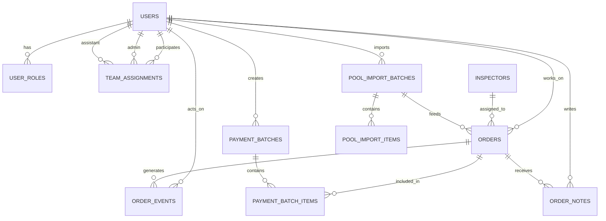
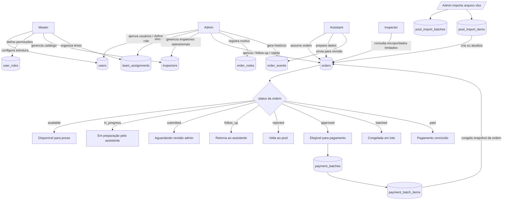

# ATA Portal — Fluxo Operacional do Sistema

## Objetivo

Este documento define o **fluxo operacional do ATA Portal**:

- como cada role interage com o sistema
- quais dados cada role pode visualizar, inserir ou alterar
- como as tabelas se relacionam
- qual é o fluxo ideal das ordens
- como evitar duplicação de funções entre telas, rotas e módulos

Este documento é a **fonte de verdade do funcionamento do sistema**.

---

# Princípios do fluxo

## 1. O sistema é orientado por workflow

O portal não existe para “mostrar tabelas”.
Ele existe para conduzir a ordem por um ciclo operacional claro:

**pool → posse → envio → revisão → aprovação/retrabalho → pagamento**

---

## 2. Cada role deve ter responsabilidades exclusivas

Se duas roles fazem exatamente a mesma coisa, a arquitetura está errada.

### Regra geral

- **Assistant** executa e envia
- **Admin** revisa, decide e organiza pagamentos
- **Inspector** consulta e executa ações limitadas
- **Master** configura a estrutura do sistema

---

## 3. O banco deve refletir o fluxo real

Cada tabela deve existir para sustentar uma etapa real do negócio.
Nada de tabela criada “vai que um dia precisa”.

---

## 4. O frontend não decide regra de negócio

O frontend apenas:

- exibe dados
- coleta ações do usuário
- envia requisições para a API

A API define:

- permissões
- transições de status
- validação
- integridade do fluxo

---

# Roles e responsabilidades

## Master

Responsável por configuração estrutural do sistema.

### Pode:

- gerenciar inspetores
- gerenciar tipos de trabalho
- gerenciar estrutura de times
- visualizar todo o sistema
- gerenciar regras administrativas globais
- promover/rebaixar acessos administrativos

### Não deve:

- operar fluxo diário de ordens
- aprovar cada ordem no dia a dia
- agir como assistente no fluxo normal

---

## Admin

Responsável pelo fluxo operacional e financeiro.

### Pode:

- revisar ordens enviadas
- aprovar ordens
- rejeitar ordens
- marcar ordens como follow-up
- informar motivo de follow-up
- informar motivo de rejeição
- preparar lote de pagamento
- liberar pagamento
- acompanhar produtividade da equipe
- gerenciar usuários pendentes
- vincular assistentes ao time
- importar pool de ordens
- corrigir conflitos de duplicidade

### Não deve:

- atuar como origem primária da inserção operacional do dia
- repetir trabalho do assistente sem necessidade

---

## Assistant

Responsável pela execução operacional.

### Pode:

- assumir ordens disponíveis
- inserir ordens a partir de caminhos recebidos
- corrigir ordens com erro antes do envio
- editar dados da própria ordem enquanto ela ainda não estiver travada para revisão
- enviar ordens para análise
- responder follow-up
- reenviar ordens corrigidas
- acompanhar suas métricas e pendências

### Não pode:

- aprovar ordens
- liberar pagamento
- decidir conflito final de duplicidade
- atribuir role para usuários
- mexer em configuração estrutural

---

## Inspector

Uso limitado e operacional.

### Pode:

- consultar dados básicos relacionados à inspeção
- visualizar itens atribuídos a ele
- consultar escopo/checklist quando esse módulo existir na nova versão
- registrar informações pontuais, se habilitado no futuro

### Não pode:

- revisar/aprovar ordens
- mexer em pagamento
- importar pool
- alterar estrutura administrativa

---

# Entidades principais do sistema

## Núcleo de acesso

- `users`
- `user_roles`
- `team_assignments`

## Núcleo operacional

- `inspectors`
- `orders`
- `order_events`
- `order_notes`

## Entrada de dados

- `pool_import_batches`
- `pool_import_items`

## Financeiro

- `payment_batches`
- `payment_batch_items`

## Catálogos auxiliares

- `work_types`

---

# Papel de cada tabela

## `users`

Armazena o usuário interno do sistema.

### Guarda:

- identidade interna
- nome
- email
- status da conta
- vínculo com autenticação
- estado de aprovação

---

## `user_roles`

Define a role do usuário.

### Exemplo:

- assistant
- inspector
- admin
- master

### Regra

Role não deve ficar espalhada em várias tabelas ou hardcoded em tela.

---

## `team_assignments`

Define qual admin é responsável por quais assistentes.

### Serve para:

- dashboards por time
- visão administrativa segmentada
- cálculo de desempenho por equipe

---

## `inspectors`

Cadastro dos inspetores reais usados no fluxo operacional.

### Guarda:

- código do inspetor
- nome
- status ativo/inativo

---

## `orders`

Tabela central do sistema.

### Guarda:

- identificação da ordem
- dados do imóvel/cliente
- status operacional
- assistente responsável
- inspetor responsável
- datas importantes
- dados vindos do pool
- vínculo com pagamento
- vínculo com lote de importação mais recente

### Regra

Toda tela principal do sistema gira em torno desta tabela.

---

## `order_events`

Histórico estruturado da ordem.

### Registra:

- mudança de status
- posse
- envio
- follow-up
- rejeição
- aprovação
- retorno ao pool
- fechamento para pagamento

### Regra

Nunca depender apenas de `updated_at` para entender o que aconteceu.

---

## `order_notes`

Observações livres ou justificativas humanas.

### Exemplos:

- motivo do follow-up
- motivo da rejeição
- observação administrativa
- contexto de correção

---

## `pool_import_batches`

Cabeçalho de cada importação do pool.

### Guarda:

- nome do arquivo
- data/hora de importação
- usuário responsável
- quantidade de linhas
- observações

---

## `pool_import_items`

Linhas importadas do arquivo de pool.

### Serve para:

- rastreabilidade
- auditoria
- comparação entre importações
- detectar atualização de ordem
- detectar ordem inexistente, repetida ou alterada

---

## `payment_batches`

Lote de pagamento fechado por período.

### Guarda:

- semana/período
- status do lote
- criado por
- aprovado por
- pago por
- datas de fechamento/pagamento

---

## `payment_batch_items`

Snapshot das ordens incluídas em um lote.

### Guarda:

- qual ordem entrou no lote
- assistente
- inspetor
- valores calculados naquele momento
- categoria/tipo de trabalho
- vínculo com o batch

### Regra

O lote precisa virar um retrato congelado.
Mudanças futuras na ordem não devem reescrever o passado financeiro.

---

# Status principais da ordem

Sugestão de fluxo oficial para `orders.status`:

- `available`
- `in_progress`
- `submitted`
- `follow_up`
- `rejected`
- `approved`
- `batched`
- `paid`
- `archived`

---

## Significado de cada status

### `available`

Ordem disponível no pool, sem posse operacional ativa.

### `in_progress`

Ordem já assumida por um assistente e em preparação.

### `submitted`

Ordem enviada pelo assistente e aguardando revisão administrativa.

### `follow_up`

Ordem precisa de correção complementar pelo assistente.

### `rejected`

Ordem rejeitada e devolvida ao pool, com motivo obrigatório.

### `approved`

Ordem validada pelo admin e elegível para pagamento.

### `batched`

Ordem já incluída em lote financeiro.

### `paid`

Ordem já teve pagamento consolidado.

### `archived`

Ordem encerrada e movida para visão histórica.

---

# Fluxo ideal da ordem

## Etapa 1 — Pool entra no sistema

O Admin importa o `.xlsx` do pool.

### Resultado:

- cria um `pool_import_batch`
- cria/atualiza `pool_import_items`
- cria novas `orders` ou atualiza ordens já existentes

### Regras:

- a importação não deve sobrescrever cegamente dados operacionais
- atualizações críticas devem respeitar trava de negócio
- ordens já trabalhadas não podem perder histórico

---

## Etapa 2 — Ordem fica disponível

Após importação, a ordem entra como:

- `available`

Ela pode ser:

- assumida por um assistente
- filtrada por time
- localizada por código externo

---

## Etapa 3 — Assistente assume e prepara

O Assistant cola caminhos, processa os dados e o sistema tenta localizar as ordens no banco.

### Possíveis resultados:

#### Caso A — ordem existe e está válida

segue para preparação e envio

#### Caso B — ordem não existe

fica bloqueada para correção manual ou remoção

#### Caso C — duplicata ou conflito

entra em análise administrativa

### Regra

O botão de envio só deve ser liberado quando todas as ordens do lote local estiverem válidas.

---

## Etapa 4 — Assistente envia para revisão

Quando o conjunto estiver correto, o assistente envia.

### Resultado:

- `orders.status = submitted`
- cria evento em `order_events`
- registra data de envio
- trava partes sensíveis da edição

---

## Etapa 5 — Admin revisa

O Admin analisa a ordem enviada.

### O Admin pode:

#### Aprovar

- muda para `approved`
- registra evento
- torna elegível para pagamento

#### Marcar follow-up

- muda para `follow_up`
- motivo obrigatório
- volta para o dashboard do assistente

#### Rejeitar

- muda para `rejected`
- motivo obrigatório
- ordem retorna ao pool

#### Resolver conflito de duplicidade

- decide qual informação prevalece
- registra motivo da decisão

---

## Etapa 6 — Assistente responde follow-up

Quando há follow-up:

- a ordem reaparece para o Assistant
- o motivo deve ser exibido claramente
- o assistente corrige e reenviar

### Resultado:

- volta para `submitted`
- novo evento no histórico

### Regra

Follow-up não pode ser um limbo eterno.

Sugestão:

- se não houver resposta dentro de X dias, pode virar rejeição automática ou alerta administrativo

---

## Etapa 7 — Ordem aprovada entra no financeiro

Ordens `approved` ficam disponíveis para loteamento.

O Admin cria um `payment_batch`.

### Ao gerar o lote:

- seleciona ordens elegíveis
- congela valores
- cria `payment_batch_items`
- marca a ordem como `batched`

---

## Etapa 8 — Pagamento concluído

Quando o lote for pago:

- `payment_batches.status = paid`
- ordens relacionadas podem ir para `paid`
- histórico financeiro é preservado

---

# Fluxo entre roles

## Relação Master → Admin

O Master define a estrutura e os parâmetros do sistema.

## Relação Admin → Assistant

O Admin supervisiona o Assistant, revisa o que foi enviado e organiza pagamento.

## Relação Admin → Inspector

O Admin mantém a estrutura operacional e a associação correta de inspetores.

## Relação Assistant → Order

O Assistant executa, corrige e envia.

## Relação Admin → Order

O Admin revisa, decide e fecha o ciclo operacional.

---

# Interação entre tabelas

---

# Fluxograma principal do sistema

---

# Matriz de acesso por role

## Master

### Leitura

* tudo

### Escrita

* users
* user_roles
* team_assignments
* inspectors
* work_types
* configurações globais

---

## Admin

### Leitura

* users
* team_assignments
* inspectors
* orders
* order_events
* order_notes
* pool_import_batches
* pool_import_items
* payment_batches
* payment_batch_items

### Escrita

* users (aprovação/bloqueio)
* team_assignments
* inspectors
* orders (revisão e decisões)
* order_events
* order_notes
* pool_import_batches
* pool_import_items
* payment_batches
* payment_batch_items

---

## Assistant

### Leitura

* próprias ordens
* próprios eventos/notas permitidos
* métricas próprias
* ordens disponíveis para posse, se permitido pela regra do time

### Escrita

* orders (campos operacionais permitidos)
* order_events (via API)
* order_notes (quando aplicável)

### Restrições

* não escreve em pagamento
* não aprova ordem
* não define role
* não altera estrutura de time

---

## Inspector

### Leitura

* dados estritamente necessários à sua operação
* escopos/checklists atribuídos
* informações básicas da ordem vinculada

### Escrita

* somente campos específicos do módulo de inspeção, se habilitado

---

# Regras de negócio obrigatórias

## 1. Motivo obrigatório

Sempre exigir motivo em:

* follow-up
* rejeição
* decisão de conflito/duplicidade
* bloqueio manual relevante

---

## 2. Histórico obrigatório

Toda transição importante deve gerar `order_events`.

---

## 3. Snapshot financeiro obrigatório

Pagamento nunca deve depender de cálculo solto em tempo real sobre ordens antigas.

O valor do lote deve ser congelado em `payment_batch_items`.

---

## 4. Aprovação separada de execução

Quem executa a ordem não é quem aprova a ordem.

---

## 5. Permissão definida na API

Nenhuma role deve ser protegida apenas por frontend.

---

## 6. Ordem rejeitada volta ao pool

Ao rejeitar:

* remover estado de posse ativa se necessário
* registrar motivo
* permitir reassunção futura

---

## 7. Follow-up não substitui rejeição

Use `follow_up` apenas quando existe correção plausível.

Use `rejected` quando a ordem deve realmente sair da mão do assistente.

---

# Como evitar repetição de funções

## Problema clássico

Uma mesma ação aparecer em:

* tela de assistant
* tela de admin
* importador
* dashboard
* rota separada

cada uma com regra diferente.

## Regra correta

Cada ação crítica deve ter  **um dono funcional** .

### Exemplo

#### Ação: aprovar ordem

* dono funcional: Admin
* endpoint único de negócio: `POST /orders/:id/approve`
* histórico gerado no mesmo lugar
* validação centralizada na API

#### Ação: marcar follow-up

* dono funcional: Admin
* endpoint único de negócio: `POST /orders/:id/follow-up`

#### Ação: rejeitar ordem

* dono funcional: Admin
* endpoint único de negócio: `POST /orders/:id/reject`

#### Ação: reenviar ordem corrigida

* dono funcional: Assistant
* endpoint único de negócio: `POST /orders/:id/resubmit`

---

# Endpoints de negócio sugeridos

## Auth / usuário

* `GET /me`
* `GET /users`
* `PATCH /users/:id/approve`
* `PATCH /users/:id/block`
* `PATCH /users/:id/role`

## Team

* `GET /team-assignments`
* `POST /team-assignments`
* `DELETE /team-assignments/:id`

## Pool

* `POST /pool-import`
* `GET /pool-import/batches/:id`

## Orders

* `GET /orders`
* `GET /orders/:id`
* `POST /orders/:id/claim`
* `PATCH /orders/:id`
* `POST /orders/:id/submit`
* `POST /orders/:id/follow-up`
* `POST /orders/:id/reject`
* `POST /orders/:id/approve`
* `POST /orders/:id/resubmit`

## Payments

* `GET /payment-batches`
* `POST /payment-batches`
* `GET /payment-batches/:id`
* `POST /payment-batches/:id/close`
* `POST /payment-batches/:id/pay`

---

# Conclusão

O ATA Portal deve funcionar como um sistema de workflow operacional com papéis claros:

* o **Assistant executa**
* o **Admin revisa e decide**
* o **Master estrutura**
* o **Inspector participa de forma limitada**

A tabela central do sistema é `orders`, apoiada por:

* histórico (`order_events`)
* contexto humano (`order_notes`)
* entrada de dados (`pool_import_*`)
* financeiro (`payment_batch_*`)

Se uma funcionalidade não respeitar esse fluxo, ela está no lugar errado ou foi duplicada.
