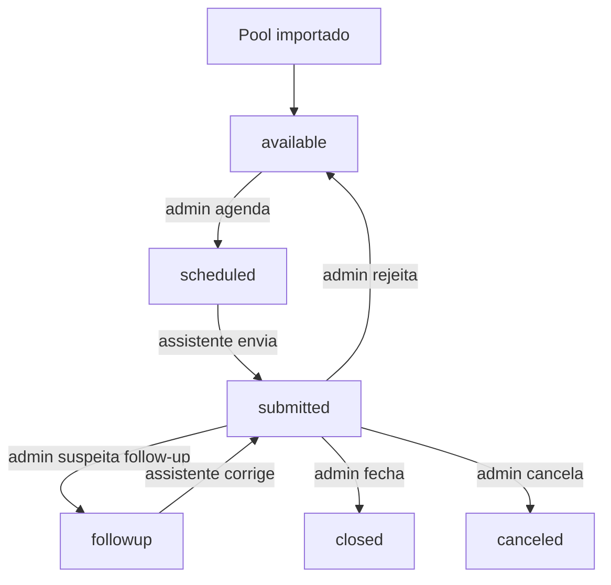
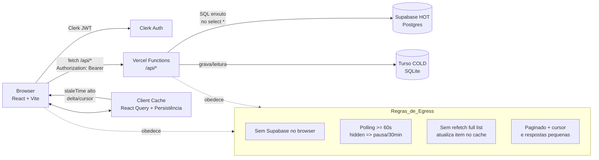
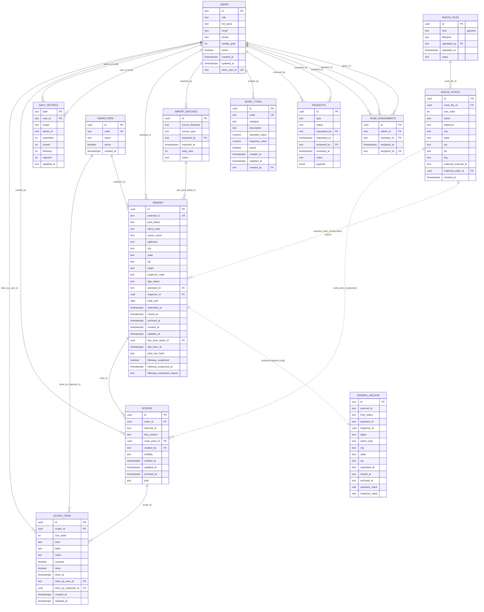

# ATA MANAGEMENT PORTAL

<a href='https://supabase.com/' target="_blank"></a>
<a href='https://turso.tech/' target="_blank"></a>
<a href='https://vercel.com/' target="_blank"></a>

<a href='https://vite.dev/' target="_blank"></a>
<a href='https://reactjs.org/' target="_blank"></a>
<a href='https://www.typescriptlang.org/' target="_blank"></a>
<a href='https://tailwindcss.com/' target="_blank"></a>


<a href='' target="_blank"></a>

---

Sistema ERP web para gestão de ordens, time e fluxos administrativos. O foco do portal é organizar o ciclo de vida das ordens (pool → execução → envio → fechamento), operação do time e visibilidade de métricas diárias/semanais.

## 📚 Documentos do projeto (leia primeiro)

- `docs/README-regras.md` — regras não negociáveis (egress/custo/arquitetura)
- `docs/README-HANDOFF.md` — estado atual, decisões e histórico de mudanças (handoff)
- `docs/README-objetivos.md` — objetivos por fase + critérios de “pronto”
- `docs/README-otimizacao.md` — plano de otimização global (GET/egress/functions)

## **Objetivo técnico (regra de ouro):**

**Reduzir ao máximo o egress do Supabase.**
  A aplicação deve funcionar com cache agressivo, dados não 100% em tempo real, e polling controlado (padrão **5min** / hidden **30min**; nunca < 60s), priorizando     tráfego mínimo.

✅ Diretriz: o frontend não deve consultar o Supabase diretamente.
➡️ O acesso ao banco acontece via API `/api/*` (Vercel Functions) autenticada pelo Clerk.

```mermaid
sequenceDiagram
  autonumber
  participant UI as Browser (React)
  participant Cache as React Query + Persistência
  participant API as /api (Vercel)
  participant HOT as Supabase HOT
  participant COLD as Turso COLD

  UI->>Cache: Load screen (read cached data)
  alt Cache is fresh (staleTime ok)
    Cache-->>UI: Render immediately (no network)
  else Cache stale
    UI->>API: GET /api/orders?limit=20&cursor=...
    API->>HOT: SELECT minimal columns + LIMIT
    HOT-->>API: items + nextCursor
    API-->>UI: items + nextCursor
    UI->>Cache: Persist items (cache local)
  end

  loop Polling (>=5min&#59; hidden => pause/30min)
    UI->>API: GET /api/orders?updatedSince=...
    API->>HOT: SELECT changed rows only
    HOT-->>API: delta
    API-->>UI: delta
    UI->>Cache: Merge delta (no full refetch)
  end

  Note over UI,Cache: After mutations: update only the item in cache, not the whole list
  Note over API,HOT: No select * + paginate everything
  Note over API,COLD: Cold DB can receive writes (metrics + archive)
```



---
## Visão geral do negócio

A empresa é contratada pela Safeguard para realizar inspeções de propriedades (casa, apartamento, comercial). O inspetor executa a inspeção, envia fotos/evidências e o assistente responde/organiza o envio (Safeguard + clientes finais).

### **Pool de ordens (origem):**

O “pool” é a base de demandas recebida da Safeguard e chega via planilhas (`.xlsx`). 
Administradores importam esse pool no sistema para criar/organizar ordens e acompanhar o fluxo operacional.

---

## **Perfis (roles)**

- **Assistente** (`user`): trabalha as ordens atribuídas, envia/submete, acompanha pendências, follow-ups e meta semanal.

- **Admin** (`admin`): controla time (vínculos), aprova/gerencia exceções, acompanha performance.

- **Master** (`master`): configuração global (work types, inspetores etc.) e visão total.

---

## Modelo de dados: IDs e autenticação
### IDs importantes

- Clerk fornece o `clerk_user_id` (identidade externa).
- No banco `public.users`, existe:
  - `id` (ID interno do sistema)
  - `clerk_user_id` (único, para mapear Clerk → user interno)

✅ Regra do projeto: FKs e identidade operacional usam `users.id` (ID interno; tratar como string — geralmente UUID, mas não assumir tipo).
O `clerk_user_id` existe para autenticação (Clerk) e para resolver/atualizar o usuário interno (`users.id`) no backend.

> Importante: nunca tratar `clerk_user_id` como “ID de aplicação” no payload. A API deve sempre resolver `Clerk JWT (sub)` → `users.id` internamente.

---

## Fluxo de ordens (alto nível)

O fluxo gira em torno da tabela orders e do campo app_status.

**Status oficial (`orders.app_status`)**
- `available`
- `scheduled`
- `submitted`
- `followup`
- `canceled`
- `closed`

**Follow-up (como funciona)**

Follow-up não é “**audit_flag**”. Ele é sinalizado por:

- `followup_suspected = true`
- `followup_suspected_at`
- `followup_suspected_reason`
e pode coexistir com o status (normalmente em followup ou submitted, dependendo do fluxo).


> Ordens rejeitadas voltam para o estágio de `available`.

### Ciclo de vida de uma Order (com o enum real `app_status`)



---

## **Arquitetura (atual)**
**Camadas**

- **Frontend (Vite + React)**
  - React Query/SWR (cache + persistência opcional)
  - Polling >= 60s (com ajuste quando `document.hidden`)

- API (Vercel Functions em `/api/*`)
  - Autenticação via Clerk (token do usuário)
  - Queries enxutas (sem `select *`, com paginação, filtros, delta)

- **DB HOT (Supabase Postgres)**
  - Dados operacionais “vivos” (ordens ativas, requests, work_types, vínculos)

- **DB COLD (Turso)**
  - Dados históricos e agregações (ex.: `daily_metrics`, `orders_archive`, `order_history`)
  - Payments ledger (snapshot): `payment_batches`, `payment_batch_items` e `payments` (evento de pagamento do lote)
  - Também recebe gravações (não é read-only)

> Nota (Payments/COLD): no Turso (SQLite) as datas são persistidas como `TEXT` (ISO string) e `week_start/week_end` como `TEXT` em `YYYY-MM-DD`.
 
### Payments (COLD / Turso) — endpoints principais

- Histórico/relatórios do `/dashboard/payments` lê do COLD:
  - `GET /api/payments/batches`
  - `GET /api/payments/batch-items`
- Para “congelar” uma semana (snapshot no COLD): `POST /api/payments/ledger/sync-week` (`week_start/week_end`).
- No HOT (Supabase), é recomendado adicionar ponteiros em `orders`:
  - `last_payment_batch_id` (text) e `last_batched_at` (timestamptz) para debug e para o `open-balance` ficar barato.

---

## **Módulos principais**

- **Dashboard:** visão geral, meta semanal, avisos e métricas de operação.
- **Orders:** lista e filtros; paginação por cursor.
- **OrdersNew:** inserção em lote e validação.
- **AdminApprovals:** tratamento e revisão das ordens.
- **AdminPoolImport:** importação de pool (`.xlsx`) via `/api/*` (sem Supabase no client).
- **Requests:** solicitações consolidadas (`work_type`, `duplicate_order`, `other`).
- **Work Types:** configuração de tipos/valores (substitui `order_pricing`).
- **Team:** vínculos admin ↔ assistentes via `team_assignments`.

> Observação: funcionalidades marcadas como DESCONTINUADO seguem no código por compatibilidade do “site antigo”, mas não são prioridade de manutenção.

---

## Rotas (mapa de telas)
- `/`: landing
- `/auth`: autenticação (Clerk)
- `/welcome`: seleção de persona (Assistente/Inspetor)

### Assistente (persona=`assistant`)
- `/dashboard` (home do assistente)
- `/dashboard/orders`
- `/dashboard/orders/new`
- `/dashboard/performance`
- `/dashboard/scopes`
- `/dashboard/settings`

### Inspetor (persona=`inspector`)
- `/dashboard` (home do inspetor: busca de escopo + resumo diário cacheado)
- `/dashboard/settings`

### Admin
- `/admin`
- `/admin/team`
- `/admin/approvals`
- `/admin/pool-import`
- `/admin/redo-orders`
- `/admin/payments`
- `/admin/payments/history`

### Master
- `/master`
- `/master/inspectors`
- `/master/work-types`
- `/master/teams`

---

## Estrutura de dados (resumo)
### DB HOT (Supabase)
- **users**
  - id, role, full_name, email, phone, weekly_goal, active, created_at, updated_at, clerk_user_id

- **user_personas**
  - user_id, persona (`assistant`|`inspector`), created_at, updated_at

- **inspector_profiles**
  - user_id, origin_city, origin_state, origin_zip, created_at, updated_at

- **inspector_user_assignments**
  - id, user_id, inspector_id, assigned_by, assigned_at, unassigned_by, unassigned_at, notes

- **work_types**
  - id, code, category, description, assistant_value, inspector_value, active, created_at, updated_at, created_by

- **team_assignments**
  - id, admin_id, assistant_id, assigned_at, assigned_by

- **requests**
  - id, type, status, requested_by, requested_at, reviewed_by, reviewed_at, notes, payload

- **orders**
  - id, external_id, pool_status, client_code, owner_name, address1, city, state, zip, otype, inspector_code, app_status, assistant_id, inspector_id, hold_until, submitted_at, closed_at, archived_at, created_at, updated_at, last_seen_batch_id, last_seen_at, pool_row_hash, followup_suspected, followup_suspected_at, followup_suspected_reason

- **scopes**
  - id, order_id, external_id, kind, loss_reason, route_point, visibility, created_by, created_at, updated_at, archived_at

- **scope_items**
  - id, scope_id, sort_order, area, label, notes, required, done, done_at, done_by_user_id, done_by_inspector_id, created_at, updated_at

- **inspectors_directory** (slot/código do inspetor; pode existir como `inspectors` em instâncias antigas)
  - id, code, name, active, created_at

- **import_batches**
  - id, source_filename, source_type, imported_by, imported_at, total_rows, notes

### DB COLD (Turso)
- **daily_metrics**
  - date, scope, user_id, admin_id, submitted, closed, followup, rejected, updated_at

- **orders_archive**
  - id, external_id, final_status, assistant_id, inspector_id, otype, client_code, city, state, zip, submitted_at, closed_at, archived_at, assistant_value, inspector_value

- **order_history** (auditoria; recomendado no COLD)
  - id, order_id, previous_status, new_status, change_reason, changed_by, details, created_at

### Tabelas planejadas

- scopes, scope_items (escopos e checklist operacional)

- rotas/GPX (futuro): route_files, route_points

### Organização Estrutural



---

## Regras críticas: egress mínimo do Supabase

### ⏱️ Polling / crons
- Proibido polling < **60s**
- Recomendado: **60–180s**
- Se `document.hidden === true:`
  - pausar ou subir para >= 30 min (padrão)
- Evitar refetch automático em:
  - focus / reconnect / visibility change
  - se isso gerar múltiplas queries

### 🔁 Redução de requisições
- Nunca duplicar query (server+client / SSR+CSR)
- Após mutate (insert/update/delete):
  - não refazer lista inteira
  - atualizar apenas o item no cache/state

### 📦 Respostas pequenas
- Proibido `select *`
- Paginação sempre (`limit`, cursor)
- Filtros sempre que possível
- Evitar JOIN pesado em endpoints com polling

### 🧠 Cache agressivo no client
- React Query/SWR com `staleTime` alto (1–5 min+)
- Cache persistente (IndexedDB/localStorage) quando fizer sentido
- Preferir delta por `updated_at`

### 📊 Validação
- Logar/medir:
  - requisições ao Supabase por minuto
  - tamanho médio de resposta (quando possível)
- Meta:
  - 1–3 GB/mês
  - evitar > 5 GB
 


---

## Variáveis de ambiente
### Frontend (Vite)

Crie `.env` (use `.env.example` como base):
```
VITE_PUBLIC_CLERK_PUBLISHABLE_KEY=...
```
> Nota: o projeto usa proxy no Vite para `/api` (porta 3000) durante desenvolvimento local.

### API (Vercel Functions)
Configure as envs no ambiente (Vercel / local):
```
CLERK_SECRET_KEY=...
SUPABASE_DATABASE_URL=...
TURSO_DATABASE_URL=...
TURSO_AUTH_TOKEN=...
```

---

## Como rodar localmente
### 1) API (Vercel dev)
```
npm run dev:api
```

### 2) Frontend (Vite)

```
npm install
npm run dev
```
- Front: `http://localhost:8080`
- API: `http://localhost:3000`
- Proxy `/api` → `3000` (reinicie o Vite após mudar `vite.config.ts`)

---

## Scripts úteis
```
npm run dev
npm run build
npm run preview
npm run lint
npm run lint:fix
```

---

## Notas importantes (compatibilidade com o site antigo)
- O frontend deve usar /api para tudo que for dado operacional.
- Se alguma tela ainda estiver usando Supabase client no browser, ela deve ser migrada (prioridade: telas com polling/listas grandes).
- `requests` substitui fluxos antigos de tabelas específicas (ex.: duplicate/work_type requests separados).
- `work_types` substitui `order_pricing` (fonte única de valores).

---

## API Endpoints (contrato + exemplos)
> **Regra:** o frontend não chama Supabase. Tudo passa por `/api/*` (Vercel Functions) com **Clerk Auth**.

### (Em construção)

Este README não lista todos os endpoints. Referências:

- Routers (Vercel Functions): `api/[...route].ts` e `api/*/[...route].ts`
- Handlers novos: `server/api/*`
- Handlers legacy/compat: `server/legacy/*`
