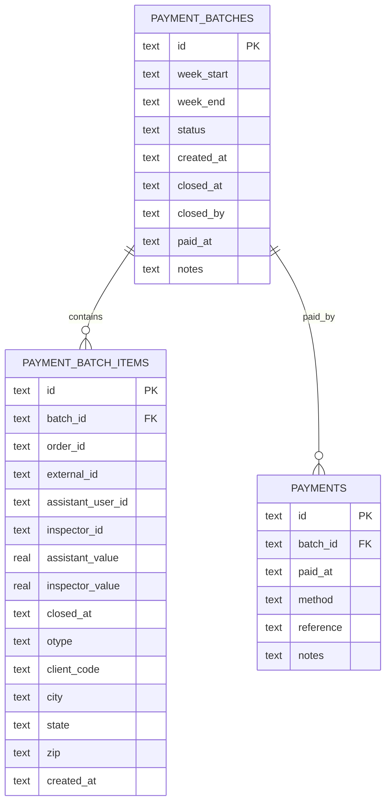
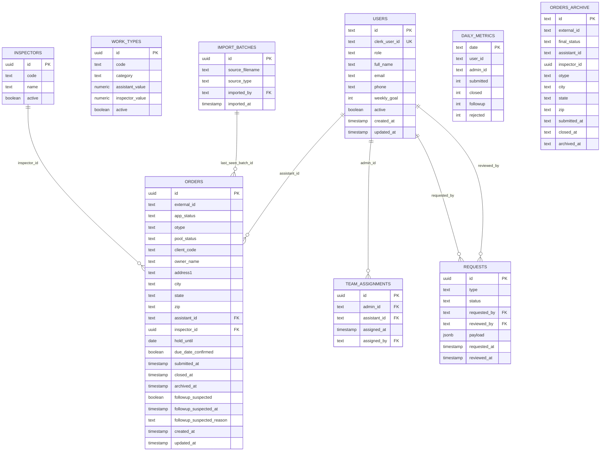

# ATA MANAGEMENT PORTAL — README HANDOFF

> Documento de handoff técnico e operacional  
> **Objetivo principal:** reduzir drasticamente egress do Supabase mantendo o site legado funcional.

---

## 🎯 VISÃO GERAL

O **ATA MANAGEMENT PORTAL** é um ERP web para gestão de ordens de inspeção, times, pagamentos e métricas operacionais.

Este repositório está em **fase de migração arquitetural**, com as seguintes diretrizes:

- ❌ **Supabase NÃO pode ser usado no browser**
- ✅ **Clerk** como Auth (client + server)
- ✅ **Vercel Functions** como camada de API
- ✅ **Supabase** apenas como **DB HOT**
- ✅ **Turso** como **DB COLD** (histórico + métricas)
- 🧠 **Cache agressivo no client**
- 📉 **Menor egress possível do Supabase**

---

## 🧱 STACK ATUAL

- **Frontend**
  - Vite
  - React 18
  - TypeScript
  - Tailwind + shadcn/ui
  - React Router
  - @tanstack/react-query v5

- **Backend**
  - Vercel Functions (`/api/*`)
  - Clerk (auth + JWT)
  - Supabase (Postgres – HOT)
- Turso (SQLite – COLD)

---

## 🧾 INVENTÁRIO (atualizado em 2026-02-19)

> Nota: este documento é um handoff operacional. As regras “não negociáveis” vivem em `docs/README-regras.md` (fonte de verdade).

### Decisões

- `legacy/orders` está **congelado** (sem novas features). Migração gradual para `/api/orders` e telas novas por prioridade.
- Prioridade de migração de telas: **Assistente primeiro**, depois **Admin/Master**.
- `Supabase`: não existem mais `order_scopes/order_scope_items`. O sistema de escopos usa **apenas** `scopes/scope_items`.
- **Identidade interna obrigatória:** relacionamentos e auditoria devem usar **`users.id`** (ID interno; **tratar como string**, não assumir tipo). `clerk_user_id` é apenas autenticação (Clerk) e chave de upsert/lookup.

### Estado do código (resumo)

- Scopes (backend): `/api/scopes` já opera em `public.scopes` + `public.scope_items`.
- Scopes (IDs): `scopes.created_by` e `scope_items.done_by_user_id` agora são persistidos como `users.id` (ID interno). (Compatibilidade: alguns checks ainda aceitam `clerk_user_id` em linhas antigas.)
- Scopes (frontend): `src/hooks/useInspectionScopes.tsx` e `src/pages/dashboard/InspectionScopes.tsx` usam o endpoint acima.
- Orders (API nova): `/api/orders` já suporta busca por `external_id` (usado pelo gerador de escopo) e inclui `address2` no payload.
- Profiles: `/api/legacy/profiles` agora lê de `public.users` e trabalha com IDs internos (`users.id`), mantendo o shape legado (`{ id, user_id, ... }`).
- Team: `/api/legacy/team-assignments` agora retorna IDs internos (`users.id`) para `adminId` e `assistants[].id` (inclui `adminClerkUserId/clerkUserId` como campos auxiliares).
- Outros legados migrados para `users.id`: `order-stats`, `order-followups`, `order-history`, `payment-requests`, `payment-batches`, `notifications`, `notification-preferences`, `duplicate-requests`, `work-type-requests`, `inspector-route-notes`, `audit-logs`, `user-roles` (a maioria aceita UUID string e `user_*` por compat).
  - `duplicate-requests` e `work-type-requests` agora retornam IDs internos (`users.id`) nos campos `*_id` e expõem `*_clerk_user_id` apenas como campo auxiliar (quando necessário).
  - `legacy/orders` agora normaliza `assistant_id`, `created_by`, `updated_by` na resposta para `users.id` (e expõe `*_raw`/`*_clerk_user_id` para compatibilidade e debug).
  - `api/orders/:id` (PATCH) agora preenche `orders.updated_by = auth.user.id` quando a coluna existe (auditoria consistente).
  - `legacy/invitations` lista convites com `created_by/used_by` normalizados (`users.id`) e filtro `updated_since` funcional.
  - `legacy/payment-batch-items` agora resolve `assistant_id` para `users.id` no POST e aceita filtro compatível (`assistant_id::text`) para linhas antigas.
  - `legacy/open-balance` agora considera compatibilidade (`assistant_id::text`) para ordens antigas que tinham `assistant_id` salvo como `clerk_user_id`.
  - `legacy/inspection-scopes` agora normaliza `scope_items.done_by_user_id` na resposta (`users.id`) e expõe `done_by_user_id_raw/done_by_user_clerk_user_id` para compat/debug.
  - `legacy/pool-import-batches` agora normaliza `imported_by` na resposta (`users.id`) e expõe `imported_by_raw/imported_by_clerk_user_id`.
  - `legacy/team-assignments` agora expõe `assigned_by` normalizado (e `assigned_by_raw/assigned_by_clerk_user_id`) nos payloads de GET/POST/DELETE.
  - `legacy/payment-requests` agora normaliza `assistant_id` e `reviewed_by` na resposta (e expõe `*_raw/*_clerk_user_id` para compat/debug).
  - `legacy/order-history` agora normaliza `changed_by` na resposta (e expõe `changed_by_raw/changed_by_clerk_user_id`).
- Performance/cache: React Query tem persistência via **localStorage** (ver `src/lib/reactQueryPersist.ts`). (Opcional futuro: IndexedDB.)
- Vercel Functions: inventário em `docs/vercel-functions-inventory.md` (**10 functions** no total — abaixo do limite de 12). API consolidada no root `api/[...route].ts` + catch-alls por namespace quando necessário para evitar `NOT_FOUND`/`static 404` em produção.
- Otimização global (GET/egress/functions): plano em `docs/README-otimizacao.md`.
- Vercel Functions: adicionado `api/inspectors/[...route].ts` como catch-all dedicado de inspectors para garantir que `/api/inspectors/assignments` não caia em `NOT_FOUND` no deploy (alguns ambientes estavam tratando esse path como “static”).
- (2026-02-10) Fix: `/admin/pool-import` não carregava por erro de runtime (ReferenceError/TDZ em `loadPreviewData`); a ordem das declarações foi corrigida.
- (2026-02-10) Docs: `docs/README-regras.md` atualizado para refletir o entrypoint real (`api/[...route].ts`) e a estrutura real do código (`server/api` + `server/legacy`).
- (2026-02-10) Docs: `docs/README-scope.md` atualizado para refletir IDs internos (`users.id`) em `created_by/done_by_user_id` e alinhar nota de auth/visibilidade.
- (2026-02-10) Docs: `docs/README-tools-routing.md` corrigido (markdown/code fence).
- (2026-02-10) Refactor: movido código compartilhado do backend de `api/_lib/*` para `server/_lib/*` para reduzir risco de “explodir” o número de functions e estabilizar o deploy (mantendo o roteamento via catch-alls).
- (2026-02-10) Repo: `.gitignore` atualizado para ignorar `.env`/`.env.*` (evitar commit acidental de secrets).
- (2026-02-10) Env: padronizado docs para `SUPABASE_DATABASE_URL` (era `SUPABASE_URL`/`SUPABASE_SERVICE_ROLE_KEY`, mas o backend usa conexão via `pg`).
- (2026-02-11) RBAC: hardening em endpoints legacy sensíveis:
  - `audit-logs`: GET restrito a `admin/master`; POST `user` só pode logar para si.
  - `notifications`: POST restrito a `admin/master` (GET/PATCH continuam self).
  - `order-history`: `user` só lê/escreve histórico de ordens próprias; `changed_by` é forçado para `auth.user.id` em `user`.
  - `payment-batches`: `user` só enxerga batches onde existe `payment_batch_items` dele; PATCH em `/payment-batches/:id` restrito a `admin/master`.
  - `payment-batch-items`: `user` só enxerga itens dele; POST restrito a `admin/master`.
  - `work-types`: POST/PATCH restritos a `master`.
  - `user-roles`: `user` só pode consultar o próprio `user_id`.
- (2026-02-11) RBAC: hardening adicional em requests:
  - `duplicate-requests` (POST): `original_created_at/original_assistant_id` agora são derivados do banco; valida `external_id` ↔ `original_order_id` (evita spoof/notify indevido).
  - `order-followups` (POST): `user` só consegue criar followup para ordens próprias (valida ownership via `orders.assistant_id`).
- (2026-02-11) Auth: `requireAuth` agora retorna `401` quando o token Clerk é inválido/expirado (antes podia virar `500`), e mantém `500` para misconfig (ex.: `CLERK_SECRET_KEY` ausente).
- (2026-02-11) Routing: fix no parser do catch-all (`api/[...route].ts`) para suportar `req.query.route` vindo como `"legacy/open-balance"` (string com `/`) em produção; isso evita `404` indevido em `/api/legacy/*`.
- (2026-02-11) Routing: hardening extra no parser do catch-all para ignorar `?query`/`#hash` caso o `route` venha “sujo” (evita `404` em `/api/legacy/*` em alguns ambientes).
- (2026-02-11) Routing: adicionado `api/legacy/[...route].ts` como catch-all dedicado do legacy, pois o domínio em produção retornava `x-vercel-error: NOT_FOUND` para `/api/legacy/*` (não chegava na function raiz). Inventário agora mostra 2 functions.
- (2026-02-11) Turso: `server/_lib/tursoDb.ts` agora faz lazy init do client (evita crash do deploy quando `TURSO_DATABASE_URL` não está configurado e a rota não usa Turso).
- (2026-02-11) Cache/304: chamadas authed no client (`src/lib/apiClient.ts` e `src/lib/api.ts`) agora usam `cache: "no-store"` e a API seta `Cache-Control: private, no-store` + `Vary: Authorization` (evita `304`/ETag quebrando XHR e evita cache público de payload autenticado).
- (2026-02-11) Docs: `docs/README-objetivos.md` atualizado para refletir o estado real (migração, egress, legacy, roteamento, critérios de “pronto”).
- (2026-02-11) Docs: `README.md` agora aponta explicitamente para `docs/README-regras.md`, `docs/README-HANDOFF.md` e `docs/README-objetivos.md`.
- (2026-02-11) Docs: badges do `README.md` atualizados para refletir versões reais (Vite/React/TypeScript/Tailwind).
- (2026-02-11) Docs: links/badges externos do `README.md` padronizados em `https` (Supabase/Turso/Vercel/React/Tailwind) e estilo do badge do Vercel alinhado aos demais.
- (2026-02-11) Docs: `docs/README-relatorio-tecnico.md` revisado (removidas “citações” artificiais/trechos fora de contexto; alinhado ao estado real e checklist de deploy).
- (2026-02-11) DX: adicionado `.env.example` e `README.md` corrigido para usar `VITE_PUBLIC_CLERK_PUBLISHABLE_KEY` (nome real lido pelo Vite/Clerk).
- (2026-02-11) Orders: `server/api/orders` ganhou suporte a `search=` (admin UX) e `src/pages/dashboard/admin/AdminRedoOrders.tsx` passou a usar `/api/orders` (remove dependência de `/api/legacy/orders` para busca/patch).
- (2026-02-11) Orders: criado `GET /api/orders/stats` (novo) e `useOrderStats()` migrou de `/api/legacy/order-stats` para o endpoint novo.
- (2026-02-11) Orders: criado `GET/POST /api/orders/history` (slim) e migrado o frontend (dialogs, OrdersNew, TeamOrders, AdminRedoOrders) de `/api/legacy/order-history` para o endpoint novo.
- (2026-02-11) Orders: criado `/api/orders/followups` (alias) e migrados os writes (POST/PATCH) do frontend de `/api/legacy/order-followups` para o endpoint novo.
- (2026-02-11) Orders: migrados os GETs do frontend de `/api/legacy/order-followups` para `/api/orders/followups`.
- (2026-02-11) Payments: iniciado namespace novo `/api/payments/requests` (GET/POST + PATCH por id) e `usePaymentRequests` migrou de `/api/legacy/payment-requests` para `/api/payments/requests`.
- (2026-02-12) Payments (COLD): `/api/payments/batches` + `/api/payments/batch-items` agora leem do **Turso** (`server/api/payments/ledger/*`) mantendo o shape legado do frontend (sem depender de tabelas de payments no HOT).
- (2026-02-12) Payments (COLD): adicionado `POST /api/payments/ledger/sync-week` para “congelar” (snapshot) ordens `closed` no Turso por semana (`week_start/week_end`) e opcionalmente escrever ponteiros no HOT (`orders.last_payment_batch_id/last_batched_at`) quando as colunas existirem.
- (2026-02-12) Payments (legacy fallback): hardening em `payment-batches`/`payment-batch-items` para tolerar instâncias com migrações pendentes (tabela/colunas ausentes) retornando `[]`/`null` ao invés de `500`.
- (2026-02-12) Open balance: `src/pages/dashboard/MyPayments.tsx` agora usa `GET /api/payments/open-balance` (1 query) ao invés de paginar `/api/orders?app_status=closed` no client (reduz egress). O endpoint prefere `orders.last_payment_batch_id/last_batched_at` quando existem.
- (2026-02-12) Bugfix: `legacy/open-balance` corrigido (`missing FROM-clause entry for table "o"`) após adicionar filtro por `orders.last_payment_batch_id/last_batched_at`.
- (2026-02-12) Hardening: `GET /api/payments/batches` e `GET /api/payments/batch-items` agora degradam para `[]` (com `warning`) se o Turso estiver indisponível/misconfigurado, evitando quebrar o `/dashboard/payments`.
- (2026-02-12) Hotfix: `api/payments/[...route].ts` passou a usar imports dinâmicos para handlers do ledger (evita `FUNCTION_INVOCATION_FAILED` se algum módulo do COLD falhar ao carregar).
- (2026-02-12) Bugfix: corrigidos imports relativos em `server/api/payments/ledger/*` (estavam apontando para `server/api/_lib/*` ao invés de `server/_lib/*`), que causavam `payments_ledger_unavailable` em produção.
- (2026-02-12) Bugfix: corrigidos imports relativos do Turso no ledger (`server/api/payments/ledger/_lib.ts` e `server/api/payments/ledger/sync-week.ts`) que estavam apontando para `/_lib/*` na raiz do bundle da Vercel.
- (2026-02-12) Pool import: hardening em `legacy/pool-import-batches` e `legacy/pool-orders` para tolerar instâncias sem migrações de pool (tabela/colunas ausentes) retornando `[]`/`warning` ao invés de `500` ao abrir `/admin/pool-import`.
- (2026-02-12) Pool import (frontend): `usePoolImport` agora memoiza funções (`useCallback`) para evitar loop de `GET /api/pool/import-batches` causando “loading infinito” no histórico.
- (2026-02-12) Egress: adicionado “freeze por inatividade” no client — após ~10s sem interação, GETs via `apiFetch` ficam em espera e as queries ativas só atualizam na próxima interação.
- (2026-02-12) Freeze: suportado `bypassFreeze` nos fetches (não é repassado para o `fetch` nativo) para exceções de fluxos longos iniciados pelo usuário.
- (2026-02-12) Freeze: ao trocar de aba ou perder foco da janela, o app congela para evitar egress; exceções explícitas podem usar `allowWhenHidden`.
- (2026-02-12) Pool import (frontend): `importFile()` usa `bypassFreeze` para não travar no meio do processamento se o usuário ficar idle.
- (2026-02-12) Freeze (frontend): aplicado `bypassFreeze` em fluxos longos com paginação/loop (`/api/orders` com cursor) para evitar “pausa no meio” quando o usuário fica idle (ex.: Admin Payments/Team/TeamPerformance, Team* hooks e validações em OrdersNew).
- (2026-02-12) Client GET de-dupe: `apiFetch` (client) agora coalesca GET/HEAD idênticos “em voo” (mesmo método+path+token) para reduzir bursts de GET na montagem das páginas.
- (2026-02-12) Pool import (frontend): cache no browser (localStorage) para reduzir egress e evitar refetch repetido:
  - Histórico: `poolImport:history:v1` (TTL ~2min)
  - Itens por lote: `poolImport:batchOrders:v1:*` (TTL ~60s)
  - Check de WORDER: `poolImport:worderCheck:v1:*` (TTL ~2min; só cacheia resultados positivos)
- (2026-02-12) Bugfix: `POST /api/pool/import-batches` agora gera `id` quando o client não envia (evita `null value in column "id" ... import_batches`). O fluxo de ordem manual também envia `id`.
- (2026-02-12) Hotfix: corrigido bug de syntax em `server/legacy/pool-import-batches.ts` (redeclaration de `const id`), que podia derrubar a Serverless Function inteira com `FUNCTION_INVOCATION_FAILED`.
- (2026-02-12) Hardening: `api/[...route].ts`, `api/legacy/[...route].ts` e `api/orders/[...route].ts` agora usam imports dinâmicos para handlers (evita “quebrar tudo” quando um único handler falha ao carregar/parsear no deploy).
- (2026-02-12) Hardening (nota): os imports dinâmicos são feitos com `import("...")` com string literal (para o bundler incluir os arquivos). Evitar `import(path)` com variável, pois pode causar `ERR_MODULE_NOT_FOUND` em runtime no Vercel.
- (2026-02-12) DX/Runtime: geração de UUID no backend padronizada via `node:crypto` (`randomUUID`) (evita depender de `globalThis.crypto` na Function).
- (2026-02-12) Auth hardening: `requireAuth()` não depende mais de `Clerk.users.getUser()` a cada request (reduz chamadas externas e evita 500 intermitente por lookup/rate limit). Nome/email passam a ser preenchidos via claims do JWT quando disponíveis (sem sobrescrever valores existentes por `null`).
- (2026-02-12) Hotfix: corrigido `ReferenceError: decoded is not defined` no `requireAuth()` (quebrava vários endpoints com 500).
- (2026-02-12) Inspectors: `GET /api/inspectors` agora lê de `public.inspectors_directory` quando existir (fallback para `public.inspectors`), evitando lista vazia no `/dashboard/orders/new` em instâncias onde o nome da tabela é `inspectors_directory`.
- (2026-02-12) Inspectors (cache): `useInspectors()` agora limpa os caches `inspectors:active` e `inspectors:all` após mutations (create/update/toggle) e faz refetch; isso evita o caso onde o Master cria/ativa um inspetor mas o Assistente continua vendo a lista vazia por cache antigo.
- (2026-02-12) Inspectors (persona): adicionada tela `/welcome` (Assistente vs Inspetor) e endpoint `/api/onboarding` para salvar persona no HOT (`public.user_personas`).
- (2026-02-12) Inspectors (origem): inspetor informa `origin_city/origin_state/origin_zip` (HOT: `public.inspector_profiles`) para uso futuro no tool routing.
- (2026-02-12) Inspectors (autorização): inspetor só acessa o dashboard se houver código atribuído (HOT: `public.inspector_user_assignments`). Sem código, mostra “Aguardando autorização”.
- (2026-02-12) Master: `/master/inspectors` ganhou seção para **atribuir/revogar** códigos (slot) para contas de inspetor via `/api/inspectors/assignments`.
- (2026-02-12) Hotfix (schema compat): `/api/inspectors/assignments` e `/api/me` suportam `public.inspectors_directory` **ou** `public.inspectors`, e não assumem que `public.users.id` é `uuid` (tratar como string).
- (2026-02-12) Scopes (inspetor): criado `/api/scopes/lookup?external_id=...` para buscar **um** escopo por WORDER (evita listar todos os escopos no mobile; reduz egress).
- (2026-02-12) Egress: `useUserRole()` agora deriva do `useAppUser()` (evita GET extra em `/api/me`).
- (2026-02-12) UX (welcome): cache do `/api/me` no client passou a ser por usuário (key inclui `clerk_user_id`) para evitar “piscar” no `/dashboard` ao trocar/criar conta antes de ir para `/welcome`.
- (2026-02-12) Settings: `/dashboard/settings` agora usa o `UserProfile` (Clerk) como UI principal de conta (email/senha/segurança) e mantém apenas “Preferências do App” (ex: `weekly_goal`, `phone`) via `/api/me` (PATCH).
- (2026-02-12) UI/Clerk: `ClerkProvider` agora recebe `appearance` baseado nos tokens do design system (CSS vars) e o `ThemeProvider` foi movido para `src/main.tsx` (Clerk + app seguem o mesmo tema). Sidebar: removido o link duplicado “Configurações → Minha Conta” no footer (mantém “Minha Conta” no menu do usuário e na navbar mobile).
- (2026-02-12) Master Inspectors: lista de “Conta (pendente)” agora mostra fallback (`email`/`clerk_user_id`/`users.id`) quando `users.full_name` estiver vazio (JWT pode não carregar nome).
- (2026-02-12) UX (names): ao detectar `users.full_name` vazio mas Clerk ter `fullName`, o client faz um PATCH best-effort em `/api/me` uma única vez (por usuário) para preencher `public.users.full_name` e melhorar telas de Master sem chamadas extras ao Clerk backend.
- (2026-02-15) UX (avatars): `public.users.avatar_url` (opcional) é preenchido best-effort via `/api/me` (1x por usuário) usando o `clerk.user.imageUrl`. Telas Master passam a renderizar `AvatarImage` quando disponível (fallback para iniciais).
- (2026-02-15) Fix build (Vercel/TS): `InspectorCreateSchema` agora aceita `id` opcional (uuid) e `server/api/payments/batches/[id].ts` corrigiu imports relativos para `_lib/*`.
- (2026-02-15) Avatares (Master): `/api/team-assignments` e `/api/audit-logs` agora fazem backfill best-effort de `avatar_url` via Clerk backend quando o campo estiver vazio (para mostrar avatar mesmo antes de cada usuário “re-logar”).
- (2026-02-15) UX (OrdersNew): “Pontos pulados” virou lista estruturada (**Ponto pulado | Motivo**) com validação anti-erro (se informar ponto, motivo é obrigatório e vice-versa). Normaliza números para “Ponto X” e mantém preview por badge.
- (2026-02-15) UX (Relatório diário): card do inspetor agora mostra um badge de rota (“Rota completa” ou “Parou em: ...”).
- (2026-02-15) UX (Relatório diário - copiar): seção “Pontos na rota” no texto copiado agora usa bullets (`•`/`└`) e imprime “Parou em” + “Pulados” com motivo por ponto quando disponível.
- (2026-02-15) UX (Relatório diário): removido “Parou em” duplicado dentro de “Pontos na rota” (mantém no badge com cor de destaque).
- (2026-02-15) Egress (Orders): `/dashboard/orders` agora começa colapsado e pagina **6 ordens por vez** (por dia). `useOrders` foi ajustado para polling refetch apenas da 1ª página (não refaz páginas antigas) e sem refetch ao focar a aba.
- (2026-02-15) Cache (Orders): `useOrders` agora persiste em `localStorage` as **páginas já carregadas** (até 5 páginas) para reabrir `/dashboard/orders` sem novo GET imediato; remount aguarda o polling.
- (2026-02-15) UI (Settings/Clerk): `/dashboard/settings` agora envolve o `UserProfile` em card do app (sem “nested card” estranho), e Clerk ganhou hardening CSS/appearance para evitar overflow em telas pequenas.
- (2026-02-15) UI (Mobile): `DashboardLayout` agora usa `overflow-x-hidden` no `<main>` e o `body` também suprime overflow horizontal para evitar “zona vazia” + scroll horizontal.
- (2026-02-15) UI (Landing): redesenhado `/` com copy e seções mais específicas do portal (produto/fluxo/relatórios/segurança), removendo conteúdo genérico e CTAs ajustados (Entrar vs Abrir dashboard).
- (2026-02-15) UX: `freeze manager` não muda mais o cursor do browser para `wait` quando a app está “frozen” (evita piscar o cursor e parecer bug).
- (2026-02-15) UI (Landing): removido `Three.js` do Hero (era só visual, sem valor real; evita peso e confusão).
- (2026-02-15) UI (Landing): Navbar e Footer agora usam `logo-*-full.png`; removida a logo duplicada dentro do Hero (fica só a do Navbar).
- (2026-02-15) UI (Landing): logo do Navbar ficou maior no `/` (home) sem afetar o tamanho nas telas internas.
- (2026-02-12) Teams: `team-assignments` agora ignora usuários com `persona='inspector'` (inspetor não participa de equipes Admin↔Assistente), e o frontend passou a usar `/api/team-assignments` (alias do handler legacy) para evitar `NOT_FOUND` em alguns ambientes com `/api/legacy/*`.
- (2026-02-13) Legacy (migração do client): removidas as ocorrências de `/api/legacy/*` em `src/` e adicionados aliases não-legacy (ex.: `/api/open-balance`, `/api/notifications`, `/api/orders/import-holds`, `/api/scopes`, `/api/pool/*`, `/api/inspectors`, `/api/users/profiles`, `/api/requests/*`). Em alguns casos a implementação ainda delega para handlers do `server/legacy/*` (compat), mas o client não depende mais do prefixo `/api/legacy`.
- (2026-02-13) Pool: migrados endpoints de pool para `server/api/pool/*` (sem alias) mantendo o mesmo shape e hardening; rotas ativas: `GET/POST /api/pool/import-batches` e `GET/POST /api/pool/orders`.
- (2026-02-13) Notifications: migrados endpoints de notificações para `server/api/notifications/*` e preferências para `server/api/notification-preferences` (sem alias); rotas ativas: `GET/POST/PATCH /api/notifications`, `PATCH/DELETE /api/notifications/:id`, `GET /api/notifications/exists` e `GET/PATCH /api/notification-preferences`.
- (2026-02-13) Scopes: migrados endpoints de escopos para `server/api/scopes/*` (sem alias); rotas ativas: `GET/POST /api/scopes`, `PATCH/DELETE /api/scopes/:id` e `GET/POST/PATCH /api/scopes/summaries`.
- (2026-02-13) Inspectors: migrado `/api/inspectors` para `server/api/inspectors/index` (sem alias), mantendo `/api/inspectors/assignments` no namespace de inspectors.
- (2026-02-13) Open balance: migrado handler para `server/api/payments/open-balance` e criado endpoint novo `GET /api/payments/open-balance` (sem legacy); mantido `GET /api/open-balance` como compat.
- (2026-02-13) Profiles: migrado `GET /api/users/profiles` para `server/api/users/profiles` (sem legacy); `GET /api/legacy/profiles` permanece como compat.
- (2026-02-13) Duplicate requests: migrado `/api/requests/duplicate` para `server/api/requests/duplicate/*` (sem legacy) e mantido `/api/duplicate-requests/*` como compat (mesmo handler).
- (2026-02-13) Work type requests: migrado `/api/requests/work-type` para `server/api/requests/work-type/*` (sem legacy) e mantido `/api/work-type-requests/*` como compat (mesmo handler).
- (2026-02-13) Manuals: migrado `/api/manuals` para `server/api/manuals/*` (sem legacy); `GET/POST/PATCH /api/legacy/manuals` permanece como compat.
- (2026-02-13) Invitations: migrado `/api/invitations` para `server/api/invitations/*` (sem legacy); `GET/POST/PATCH /api/legacy/invitations` permanece como compat.
- (2026-02-13) Audit logs: migrado `/api/audit-logs` para `server/api/audit-logs` (sem legacy); `GET/POST/PATCH /api/legacy/audit-logs` permanece como compat.
- (2026-02-13) Inspector route notes: migrado `/api/inspector-route-notes` para `server/api/inspector-route-notes` (sem legacy); `GET/POST/PATCH /api/legacy/inspector-route-notes` permanece como compat.
- (2026-02-13) Import holds: migrado `/api/orders/import-holds` para `server/api/orders/import-holds` (sem legacy); `GET/POST/PATCH /api/legacy/order-import-holds` permanece como compat.
- (2026-02-13) Team assignments: migrado `/api/team-assignments` para `server/api/team-assignments/*` (sem legacy); `GET/POST/PATCH /api/legacy/team-assignments` permanece como compat.
- (2026-02-13) Docs: alinhados `README-regras.md`, `README-objetivos.md` e `README-relatorio-tecnico.md` com o estado atual de roteamento (catch-alls por namespace) e regra de IDs internos (“tratar como string”).
- (2026-02-13) Work types / User roles / Profiles (compat): removida delegação para `server/legacy/*` nos endpoints `/api/work-types`, `/api/user-roles` e `/api/profiles` (agora rodam via `server/api/*`).
- (2026-02-14) Legacy router: `api/legacy/[...route].ts` agora delega para `server/api/*` quando existir implementação migrada (mantém compat de `/api/legacy/*` reduzindo dependência de `server/legacy/*`).
- (2026-02-14) Root router: `api/[...route].ts` também passou a preferir `server/api/*` dentro de `dispatchLegacy()` (fallback/compat), reduzindo dependência de `server/legacy/*` quando o root captura `/api/legacy/*`.
- (2026-02-14) Order followups: migrado `order-followups` para `server/api/orders/followups` (sem legacy); `/api/orders/followups` e `/api/legacy/order-followups` agora usam o handler novo.
- (2026-02-14) Payments (legacy HOT): migrados handlers de `/api/legacy/payment-batches`, `/api/legacy/payment-batch-items` e `/api/legacy/payment-requests` para `server/api/payments/*` (sem depender de `server/legacy/*`).
- (2026-02-14) Pricing: migrado handler de pricing para `server/api/pricing/*` (sem depender de `server/legacy/pricing/*`).
- (2026-02-14) Legacy orders: movidos handlers de `/api/legacy/orders` para `server/api/orders/legacy/*` (mantém endpoint congelado, mas remove dependência de `server/legacy/orders/*`).
- (2026-02-14) Pool import batches (id): migrado `PATCH /api/pool/import-batches/:id` (e compat `PATCH /api/legacy/pool-import-batches/:id`) para `server/api/pool/import-batches/[id]` (remove dependência de `server/legacy/pool-import-batches/[id]`).
- (2026-02-14) Root router: removidos imports restantes de `server/legacy/*` em `/api/payments/batches`, `/api/payments/batch-items` e `/api/work-types` (agora usam handlers em `server/api/*`).
- (2026-02-14) Legacy cleanup: removida a implementação antiga em `server/legacy/*` (código órfão após migrações; roteadores já não dependem mais desse diretório).
- (2026-02-14) Legacy refactor: removido `server/api/legacy/*` (handlers foram consolidados em `server/api/payments/*` e `server/api/orders/legacy/*`); `api/legacy/[...route].ts` agora delega no root router.
- (2026-02-14) Compat window: adicionadas flags `LOG_API_LEGACY` e `DISABLE_API_LEGACY` no root router (`api/[...route].ts`) para observar e/ou desativar `/api/legacy/*` sem mudar código.
- (2026-02-14) Inspectors (base path): `GET /api/inspectors` agora é roteado no root router para `server/api/inspectors/index` (o catch-all `api/inspectors/[...route].ts` não cobre o path base).
- (2026-02-14) Audit logs: hardening em `server/api/audit-logs` para lidar com instâncias sem `public.audit_logs` (GET retorna `[]` + `warning`; POST retorna `503`) e loga erro no console em caso de falha.
- (2026-02-14) Routing: adicionados catch-alls por namespace para estabilizar roteamento em produção onde alguns paths estavam caindo em `404` como `static` (`/api/scopes/*`, `/api/users/*`, `/api/requests/*`, `/api/pool/*`).
- (2026-02-14) Routing: adicionados catch-alls dedicados para `work-types`, `team-assignments` e `inspectors/assignments` para estabilizar PATCH/DELETE em produção (evita `404` como `static` em alguns ambientes).
- (2026-02-14) Routing: removido catch-all dedicado de `team-assignments` para manter folga no limite de Vercel Functions (root router cobre esse namespace).
- (2026-02-14) Orders: endpoint `/api/orders` agora tolera query com `assistant_id` + `assistant_ids` (trata como lista/união) para evitar `400` em telas de performance.
- (2026-02-14) Debug: adicionada flag `TRACE_NODE_WARNING_STACK` para imprimir stack do warning `DEP0169` (`url.parse`) quando ocorrer (ajuda a identificar a dependência que ainda usa `url.parse()`).
- (2026-02-14) DEP0169 (`url.parse`) em produção: confirmado via stack trace que o warning vem do runtime da Vercel (`/opt/rust/nodejs.js`) ao acessar `req.query` (bridge do request), não de libs do projeto. Mitigação recomendada: setar `NODE_OPTIONS=--disable-warning=DEP0169` no Vercel (ou `NODE_NO_WARNINGS=1` se quiser suprimir tudo).
- (2026-02-14) Otimização global: criado `docs/README-otimizacao.md` com budgets e checklist (GET/egress/functions) e alinhados READMEs para apontar para o plano.
- (2026-02-14) Polling: intervalo padrão ficou **mais lento** (5 min visível / 30 min hidden) via `src/lib/polling.ts` e hooks que usam `useVisibilityInterval`.
- (2026-02-14) OrdersNew: `PATCH /api/orders/:id` em `/dashboard/orders/new` agora envia `assistant_id` (ID interno) junto com `submitted/scheduled` (evita `400 app_status=... requires assistant_id and inspector_id` quando o ator não é `role=user`).
- (2026-02-14) Relatórios (assistente): `OrdersList` agora enriquece as ordens com `inspectors` (diretório) e resolve `category` via `workTypes` (client-side), corrigindo `SEM_INSPETOR`/contagens por tipo no relatório diário/semanal/período.
- (2026-02-14) Relatório diário: seção **Não feitas** agora considera `followup_kind='pool_exception'` e usa `followup_reason` como motivo (mantém compat com `not_done_reason/audit_reason`).
- (2026-02-14) OrdersNew (nao_feita): ao marcar ordem como **não feita**, agora mantém `assistant_id` + `inspector_id` (não usa `auto_clear_possession`), permitindo criar followup `pool_exception` e aparecer no relatório diário.
- (2026-02-15) OrdersList (assistente): agrupamento padrão agora é por **data de atividade** (`execution_date || followup_created_at || updated_at || created_at`), evitando ordens importadas via `admin/pool-import` aparecerem no dia errado em `/dashboard/orders`.
- (2026-02-15) Relatórios (assistente): relatório semanal e de período agora filtram/contam usando **data de atividade** (não `created_at`).
- (2026-02-15) Admin `/admin/performance`: TeamPerformance agora filtra por **`submitted_at`** (não `created_at`) e o gráfico/export usa **data de atividade** (`execution_date || created_at`) para evitar distorções por `admin/pool-import`.
- (2026-02-15) Due date (HOT): adicionada flag `orders.due_date_confirmed` (fonte de verdade para “due date confirmado pelo assistente”). `OrdersNew` agora suporta `!DUE DATE MM-dd` **ou** `!DUE DATE MM-dd-yyyy` e não confunde `ok + due date` (envia `submitted` com `hold_until`).
- (2026-02-15) Pool import: `POST /api/pool/orders` agora **não sobrescreve** `orders.hold_until` quando `orders.due_date_confirmed=true` (o due date do assistente prevalece).
- (2026-02-15) Docs: revisados READMEs para remover inconsistências/duplicidades (polling hidden=30min), corrigido heading vazio no `README.md`, corrigido encoding (mojibake) no HANDOFF e atualizadas datas de “Última atualização” nos docs principais.
- (2026-02-15) Egress (Orders): criado `GET /api/orders/pending-summary` (agregado: **due dates + retornos**) e `usePendingOrders()` migrou para esse endpoint via React Query (cache compartilhado). Sidebar + Overview + notificações agora fazem **1 GET por intervalo** (5min visível / 30min hidden), sem batching `ids=...` no client.
- (2026-02-19) Dashboard (assistente): `pending-summary` agora considera ordens com `app_status='followup'` como pendências (mesmo se o request não estiver visível), evitando “Pendências = 0” incorreto no sidebar/overview.
- (2026-02-19) Dashboard (assistente): `followup` não é mais rotulado/contado como “Em Análise” (agora “Follow-up”); card “Pendentes” usa `pending-summary.pendingCount`; card “Follow-ups” mostra badge com a quantidade.
- (2026-02-19) Cache: `useOrderStats()` migrou para React Query (mantém cache localStorage) e mutações (`updateOrder`, `OrdersNew`) agora invalidam/limpam caches (`pending-summary`, `order-stats`, `followups`) para reduzir UX stale sem aumentar polling.
- (2026-02-19) Notificações (economia): removido `useDueDateNotifications()` do layout do dashboard (não chama mais `/api/notifications/exists` nem cria registros em `public.notifications`). O lembrete de prazos fica apenas via UI/toast e dados agregados (`pending-summary`).
- (2026-02-19) Motivos (Admin): ajustadas listas de motivos de follow-up e rejeição em `src/lib/rejection-reasons.ts` para refletir os casos reais; follow-up “Porcentagem ILIS incorreta” ganhou campo para informar o valor correto (aparece para o assistente).
- (2026-02-19) Admin approvals UX: `useTeamOrders.updateOrderStatus()` agora faz refresh de `/api/orders/team-approvals` mesmo se `orders/history` ou `orders/followups` falharem, e usa `bypassFreeze` para evitar “cliquei e não atualizou”.
- (2026-02-19) Erros 429/422 (Clerk): confirmado que `429 Too Many Requests` e `422 Unprocessable Content` vêm do Clerk em `*.clerk.accounts.dev` (dev keys/limites), principalmente no endpoint `/tokens`. Mitigação no client: `src/lib/apiClient.ts` agora cacheia/deduplica `getToken()` e aplica backoff quando `getToken()` falha (evita tempestade de retries). Correção definitiva: migrar para Clerk Production (keys `pk_live_...` / `sk_live_...`) com domínio válido.
- (2026-02-15) Performance: criado `GET /api/orders/performance` (agregado por assistente e período) para substituir loops de paginação em `/dashboard/performance`. `/dashboard/performance` já migrou (summary 1 GET; export busca `include_orders=1` sob demanda).
- (2026-02-16) Otimização global (Admin): removidos loops/paginação client-side e GETs auxiliares em telas Admin (sem criar novas Vercel Functions; tudo roteado pelos catch-alls existentes):
  - `/admin/performance`: `GET /api/orders/team-performance` + `useTeamPerformance` (React Query; 1 GET por período/filtro).
  - `/admin/team`: `GET /api/orders/assistants-activity` (remove loops de `/api/orders` + `GET /api/users/profiles` só para `weekly_goal`/atividade).
  - `/admin/payments`: `GET /api/payments/week-summary` (remove loops de `/api/orders` e `GET /api/work-types`; payload já inclui `amount`).
  - `/admin/approvals`: `GET /api/orders/team-approvals` (remove paginação de `/api/orders` + `followups/profiles/inspectors`).
  - `useTeamPayments`: `GET /api/orders/team-payments` (remove loop de 20 páginas para cálculo de pagamentos).
- (2026-02-16) Payments (COLD): corrigido `POST /api/payments/batch-items` no ledger (estava `405` porque o handler só aceitava `GET`). Agora faz upsert em `payment_batch_items`, enriquece `closed_at` via HOT (best-effort) e atualiza ponteiros no HOT (`orders.last_payment_batch_id/last_batched_at`) em bulk para manter `GET /api/payments/open-balance` barato. Observação: quando o ledger estiver indisponível, o roteador agora devolve `503` em writes (GET continua degradando para `[]` com `warning`).
- (2026-02-16) Payments (COLD): `POST /api/payments/batches` agora é idempotente por `(week_start, week_end)` (evita duplicar batch da mesma semana ao reprocessar/atualizar lote).
- (2026-02-16) Admin `/admin/payments`: botão não trava mais só por existir batch; agora permite **atualizar** o lote existente (parcial por assistente selecionado) e bloqueia apenas quando o batch está `closed/paid`.
- (2026-02-16) Admin `/admin/payments`: adicionado botão “Histórico” para acessar `/admin/payments/history`.
- (2026-02-16) Payments (routing/Vercel): criado `api/payments/batches/[id].ts` (function dedicada) para garantir que `PATCH /api/payments/batches/:id` não caia em `404` como `static` em produção (ex.: ação “Marcar Pago” no histórico de lotes). **Contagem atual:** 11/12 functions.
- (2026-02-16) Dashboard `/dashboard/payments`: export de invoice por lote agora suporta **PDF (resumo por categoria)** + **Excel (lista completa de ordens pagas)** (sem GET extra) via `src/hooks/usePaymentsInvoiceExport.tsx` com dynamic import de `jspdf`/`xlsx` (reduz peso do bundle inicial).
- (2026-02-16) Admin `/admin`: removido “Atualizado em tempo real” (era enganoso) e o total de ordens deixou de ser “só as 20 carregadas”; agora usa `GET /api/orders/team-approvals-summary` (count SQL) com cache 5min + refresh manual.
- (2026-02-16) Master `/master`: corrigidos cards com dados “parciais” (ex.: Total de Ordens não depende mais da lista `useOrders` limitada a 20). Agora usa `GET /api/orders/stats` para contagens reais; “Assistentes” inclui atribuídos + não atribuídos.
- (2026-02-16) Teams: hardening em `useTeamAssignments` (assign/remove/transfer) com state updates funcionais, uso de `avatarUrl/clerkUserId` vindos da API e remoção por `assignmentId` sem depender de `admin_id` — corrige remoção de assistente em `/master/teams`.
- (2026-02-16) Teams (routing/Vercel): em produção, `DELETE /api/team-assignments/:id` pode cair em `404` como `static` (não chega na function). Para manter folga no limite de Vercel Functions, a remoção agora usa `DELETE /api/team-assignments?id=...` e o handler `server/api/team-assignments/index` ganhou suporte a `DELETE`.
- (2026-02-16) Fix: `GET /api/orders/performance` estava retornando `500` por typo de variável (`inspectorTable` vs `inspectorsTable`) ao montar o SQL; corrigido para evitar falha e “piscar” na tela `/dashboard/performance` (retries do React Query).
- (2026-02-16) Relatório diário: seção **Pontos na rota** agora renderiza “Pulados” em lista (badge por ponto + motivo em linha abaixo), evitando `skipped_reason` colapsar tudo em uma linha e ficar ilegível.
- (2026-02-16) Docs: inventário de Vercel Functions atualizado em `docs/vercel-functions-inventory.md` (total 11 functions).
- (2026-02-18) Perf/cache: `useAppUser` migrou para React Query (cache/flight dedupe via `queryKey: ["me", clerkUserId]`) e `useWeeklyGoal`/`useProfile` deixaram de fazer `GET /api/me` (derivam do cache do `me` + usam `setQueryData` após `PATCH`). Isso elimina o burst de múltiplos `GET /api/me` no load (HAR mostrava 10x) e reduz flicker/egress.
- (2026-02-18) UX (Hero/mobile): fix de scroll horizontal no landing ajustando `overflow-x: hidden` também no `html` (em alguns browsers o scroll container é o `html`, não o `body`).
- (2026-02-19) Dashboard (Assistente): calendário de due dates corrigido (datas normalizadas no timezone do app). Agora marca corretamente **feitas / agendadas / vencidas**.
- (2026-02-19) Assistente `/dashboard/orders`: adicionado botão **Atualizar dados** (limpa caches `orders:`/`followups:` e força refetch). Resolve relatório diário que não refletia ordens inseridas depois (até o polling).
- (2026-02-19) Assistente (due date): adicionada ação para **confirmar ordem agendada** na lista de ordens (dialog “Sim/Não”). Ao marcar `submitted` no client, `submitted_at` passa a ser enviado automaticamente (corrige datas/relatórios).
- (2026-02-19) Dashboard overview: removido card “Ordens Recentes” (redundante com calendário e filtros).
- (2026-02-19) Sidebar (Assistente): “Status do dia” agora usa **Pendências = retornos (followups)** e **Prazos = due dates de hoje**, e o `pending-summary` trata `due_date_confirmed=null` como compatível (assume confirmado). Calendário e status fazem rollover automático ao virar o dia (timezone do app).
- (2026-02-19) Due Date (timezone/compat): `hold_until` é tratado como **data** (key `YYYY-MM-DD` via `::date`/slice) para evitar deslocamento de 1 dia quando o DB guarda meia-noite UTC. Isso corrigiu calendário, sidebar e filtros baseados em due date.
- (2026-02-19) Relatório diário: “✅ Válidas” agora **não soma** ordens de due date inseridas em dias anteriores (essas ficam em “📆 Due Date”). “⏳ Agendadas” conta apenas due dates futuras.
- (2026-02-19) Dashboard cards: `/api/orders/stats` agora calcula “hoje” no timezone do app (Fortaleza), não em `current_date` UTC.
- (2026-02-19) Cache (anti-suporte): bump de versão nos caches do browser (`orders`, `followups`, `order-stats`) para evitar que mudanças de lógica (ex.: due date keys) exijam “limpar cache e relogar”.
- (2026-02-19) Calendário: due dates futuras voltaram a aparecer (bolinha laranja sólida; “Prazo Final” hoje segue piscando).
- (2026-02-17) UX/Auth: rotas protegidas agora redirecionam usuários **SignedOut** para `/` (hero), evitando “tela em branco” quando alguém acessa deep links (ex.: `/dashboard/orders`) sem estar logado.
- (2026-02-17) Conta/Settings: removido o embed do `UserProfile` no `/dashboard/settings` (era ruim/bugava UX). Agora “Minha Conta” abre o modal do Clerk via `openUserProfile()` (sidebar + mobile). A página `/dashboard/settings` ficou como placeholder “desativado” por enquanto.
- (2026-02-17) Mobile UI: removido o bottom navbar do dashboard (o componente `MobileBottomNav` deixou de ser usado e foi removido do código) — layout voltou a usar padding normal no conteúdo (sem reservar espaço fixo no rodapé).
- (2026-02-17) Bundle/perf: libs grandes de export (`xlsx`, `jspdf`, `jspdf-autotable`) deixaram de ser importadas estaticamente e agora são carregadas via `import()` apenas quando o usuário exporta (Audit Logs / Pool Import / Admin Team Performance). Resultado: chunk principal caiu e os exports viraram chunks dedicados.
- (2026-02-17) React Query: `staleTime` default subiu para **5 min** (alinhado ao budget/polling) para reduzir refetches acidentais em telas não críticas.
- (2026-02-17) Dashboard `/dashboard/payments`: reduziu GET no carregamento inicial carregando **itens do lote sob demanda** (somente ao abrir “Ver”). `batches` + `open-balance` ficam em React Query com cache; `batch-items` fica cacheado por `batch_id`.
- (2026-02-17) Freeze manager: evitou oscilação “freeze/unfreeze” causada por eventos de mouse quando a página está **sem foco** (ex.: DevTools focado). Isso impedia “tempestade” de invalidations (`onAppResume`) que gerava centenas de GETs por minuto (ex.: `/api/orders/pending-summary`, `/api/scopes/summaries`).
- (2026-02-17) Vercel build: corrigidos erros de TypeScript (`unknown` → `string`) em handlers do backend (orders team-* + payments week-summary + payments ledger batch-items) ao normalizar IDs via `String(...)` antes de chamar `resolveUserId(...)`/`Map.get(...)`.
- (2026-02-17) Egress: removido o `onAppResume` (invalidation automática ao “descongelar”). Isso estava gerando refetch extra (especialmente em `pending-summary`) toda vez que o app congelava por inatividade e o usuário voltava a mexer o mouse/scroll — agora o refresh fica só por **polling** e por ações do usuário.
- (2026-02-15) Bundle (parcial): `/dashboard/performance` agora usa dynamic import para `xlsx`/`jspdf`/`jspdf-autotable` no export. Nota: enquanto houver imports **estáticos** dessas libs em outras telas/hooks (ex.: AuditLogs export, MyPayments, AdminTeamPerformance, PoolImport), o bundler não separa em chunk.
- (2026-02-15) DX/API: removidos módulos órfãos/duplicados de “orders” no frontend (`src/lib/api.ts`, `src/hooks/useOrdersApi.ts`, `src/queries/orders.ts`, `src/features/orders/*`) e hardening em `src/lib/apiClient.ts` (parse de JSON mais resiliente; `Content-Type` só quando há body).
- (2026-02-14) Order history (COLD): `/api/orders/history` agora persiste no **Turso (COLD)** (não precisa de `public.order_history` no HOT) e degrada para `[]` com `warning/missingTable` se o COLD estiver indisponível/misconfigurado.
- (2026-02-14) OrdersNew (audit): removido o padrão de **1 POST /api/orders/history por ordem**; agora envia **1 batch** e apenas para mudanças excepcionais com `change_reason` (reduz drasticamente requests e writes).
- (2026-02-14) Inspector route notes (client): notas do relatório diário agora ficam **somente no browser** (localStorage) e não fazem mais GET/POST em `/api/inspector-route-notes` (reduz HOT writes e requests).

### Nota: conta do inspetor (código transferível)

- O registro em `inspectors_directory` (ou `inspectors`, em instâncias antigas) deve representar o **código/slot** do inspetor (transferível), não necessariamente a “pessoa”.
- A “pessoa” é um usuário normal (Clerk) com **persona** salva no HOT:
  - `public.user_personas` (`user_id` → `persona='inspector'|'assistant'`)
  - `public.inspector_profiles` (`user_id` → origem para roteamento)
  - `public.inspector_user_assignments` (`user_id` ↔ `inspectors(_directory).id`) para saber qual pessoa “detém” qual código no momento (transferível).
- Observação importante: **não** adicionar `role='inspector'` em `public.users.role` (mantém RBAC atual `user/admin/master` estável). A diferenciação Assistente vs Inspetor é feita por `persona`.

#### SQL (HOT/Supabase) — persona + autorização do inspetor

> Observação: em algumas instâncias o “diretório de inspetores” chama `public.inspectors_directory`, e em outras chama `public.inspectors`.
> Abaixo vai a versão **compatível com sua instância** (você relatou que só existem `public.inspectors` e `public.users`, e que `public.users.id` é `text`).

```sql
begin;

-- 1) Persona (assistente vs inspetor)
create table if not exists public.user_personas (
  user_id text primary key references public.users(id) on delete cascade,
  persona text not null,
  created_at timestamptz not null default now(),
  updated_at timestamptz not null default now(),
  constraint user_personas_persona_check check (persona in ('assistant','inspector'))
);

-- 2) Perfil do inspetor (origem para roteamento)
create table if not exists public.inspector_profiles (
  user_id text primary key references public.users(id) on delete cascade,
  origin_city text not null,
  origin_state text null,
  origin_zip text null,
  created_at timestamptz not null default now(),
  updated_at timestamptz not null default now()
);

-- 3) Vínculo: usuário (pessoa) ↔ código (slot)
-- Nota: ajuste o tipo de inspector_id para casar com public.inspectors.id (normalmente é uuid).
create table if not exists public.inspector_user_assignments (
  id uuid primary key,
  user_id text not null references public.users(id) on delete cascade,
  inspector_id uuid not null references public.inspectors(id),
  assigned_by text null references public.users(id),
  assigned_at timestamptz not null default now(),
  unassigned_by text null references public.users(id),
  unassigned_at timestamptz null,
  notes text null
);

create unique index if not exists uq_inspector_assignments_user_active
  on public.inspector_user_assignments(user_id)
  where unassigned_at is null;

create unique index if not exists uq_inspector_assignments_inspector_active
  on public.inspector_user_assignments(inspector_id)
  where unassigned_at is null;

commit;
```

#### SQL (HOT/Supabase) — `users.avatar_url` (opcional)

> Usado para renderizar o avatar do Clerk (sem precisar de chamadas ao Clerk backend) em telas Master/Admin.  
> Preenchimento: client faz `PATCH /api/me` best-effort (1x por usuário) com `avatar_url=clerk.user.imageUrl`.

```sql
alter table public.users
  add column if not exists avatar_url text;
```

#### SQL (COLD/Turso) — `order_history` (auditoria)

> Produção (2026-02-14): o handler de `GET/POST /api/orders/history` foi movido para o **Turso (COLD)** para evitar writes/egress no Supabase (HOT).  
> Se a tabela não existir (ou o Turso estiver indisponível), o endpoint degrada para `[]` com `missingTable/warning` (nunca deve quebrar o fluxo do assistente).

```sql
-- COLD (Turso / SQLite)
create table if not exists order_history (
  id text primary key,
  order_id text not null,
  previous_status text null,
  new_status text null,
  change_reason text null,
  changed_by text null,
  details text null, -- JSON string
  created_at text not null -- ISO string
);

create index if not exists idx_order_history_order_created_at
  on order_history(order_id, created_at desc);
```

#### Inspector route notes (client-only) — relatório diário

> Feature: notas do “relatório do dia” (stop point / skipped points / motivo).  
> Decisão: **não persistir no DB** (não afeta regras de negócio; só UX do relatório).

- Storage: localStorage via `src/lib/inspectorRouteNotes.ts` (TTL ~14 dias).
- Chave: `inspector_route_notes:v1:<assistant_clerk_user_id>:<YYYY-MM-DD>`
- Escopo: 1 nota por inspetor por dia (upsert), suficiente para gerar o relatório.
- (2026-02-11) Work Types: criado `/api/work-types` (alias do legacy) e migrado o frontend de `/api/legacy/work-types` para o endpoint novo.
- (2026-02-11) Pricing: **consolidado em `work-types`** — `assistant_value/inspector_value` agora vivem em `public.work_types`; fluxo de aprovação de `work-type-requests` passa valores no `approve`; telas master deixam de usar `/api/legacy/pricing` (rota `/master/pricing` redireciona para `/master/work-types`).
- (2026-02-11) Hotfix: `api/[...route].ts` não depende mais de arquivos de alias “v2” para `/api/payments/batches`, `/api/payments/batch-items` e `/api/work-types`; o roteamento usa diretamente os handlers legacy (evita crash de function quando arquivos não estão presentes no deploy).
- (2026-02-11) Legacy: adicionada checklist de endpoints `/api/legacy/*` ainda usados no frontend para guiar a migração.
- (2026-02-11) DX: `npm run dev:api` agora usa `npx vercel dev --listen 3000` (evita dependência de Vercel CLI global).
- “Tabelas removidas” (HOT/Supabase): endpoints que dependiam de tabelas antigas foram migrados para `public.requests`:
  - `order-import-holds` (`public.order_import_holds` → `public.requests`)
  - `order-followups` (`public.order_followups` → `public.requests`)
  - `work-type-requests` (`public.work_type_requests` → `public.requests`)
  - `duplicate-requests` (já era `public.requests`, mas havia casts incompatíveis)
- Observação (constraints do Supabase): `requests.type` é limitado (`work_type`, `duplicate_order`, `other`). Para fluxos “internos” usamos `type='other'` e guardamos o subtipo em `requests.payload.req` (ex.: `order_followup`, `order_import_hold`).

### Próximos passos sugeridos

- Auditar e migrar telas críticas do Assistente para `/api/orders` (deixar `legacy/orders` apenas como fallback).
- Reforçar RBAC em endpoints sensíveis (ex.: profiles, invitations), se ainda não foi feito.
- Consolidar fluxo de escopos (ex.: view pública para inspetor quando `visibility=public`, sem persistência de checklist).
- (UI/Clerk) Unificar visual do “Settings” com o Clerk:
  - `/dashboard/settings`: melhorar a aparência do card do Clerk (`UserProfile`) + card de “Preferências do App”.
  - Tema: fazer o Clerk seguir o tema do site (dark/light) via `appearance` no `ClerkProvider` (ler `resolvedTheme` do `next-themes`).
  - Arquivos relevantes: `src/main.tsx`, `src/App.tsx`, `src/pages/dashboard/Settings.tsx`, `src/components/dashboard/AppSidebar.tsx`.
- (Egress/payload) Após estabilizar a migração de IDs, remover campos auxiliares `*_clerk_user_id` de endpoints onde o frontend não usa (mantendo `*_raw` quando útil para compat/debug).
- (Manutenção) Padronizar helper utilitário para normalizar referências de usuário (ex.: `normalizeUserRef`) e reduzir repetição de `left join public.users` + `(id::text OR clerk_user_id)` nos endpoints legacy.

---

## ✅ Checklist — Legacy ainda em uso no frontend (migrar)

> Objetivo: reduzir dependência do “legacy” no client.  
> Fonte desta lista: ocorrências de `/api/legacy/*` em `src/` (pode mudar com o tempo).
> Status: em **2026-02-13**, `src/` não referencia mais `/api/legacy/*` (resta migrar handlers internamente quando fizer sentido).

### Prioridade P1 (impacto direto em operação)

- [x] `GET/POST/PATCH /api/legacy/payment-requests` → `/api/payments/requests`
- [x] `GET/POST/PATCH /api/legacy/payment-batches` e `GET/POST/PATCH /api/legacy/payment-batch-items` → `/api/payments/batches` + `/api/payments/batch-items`
- [x] `GET/POST/PATCH /api/legacy/work-types` → `/api/work-types`
- [x] `GET/POST/PATCH /api/legacy/pricing` → **consolidado em `work-types`** (valores vivem em `public.work_types.assistant_value/inspector_value`)
- [x] `GET/POST/PATCH /api/legacy/inspection-scopes` → `/api/scopes` (**migrado**, `server/api/scopes/*`)
- [x] `GET/POST/PATCH /api/legacy/scope-summaries` → `/api/scopes/summaries` (**migrado**, `server/api/scopes/summaries`)
- [x] `GET/POST/PATCH /api/legacy/pool-orders` e `GET/POST/PATCH /api/legacy/pool-import-batches` → `/api/pool/*` (**migrado**, `server/api/pool/*`)
- [x] `GET/POST/PATCH /api/legacy/order-import-holds` → `/api/orders/import-holds` (**migrado**, `server/api/orders/import-holds`)
- [x] `GET/POST/PATCH /api/legacy/notifications` e `GET /api/legacy/notifications/exists` → `/api/notifications/*` (**migrado**, `server/api/notifications/*`)
- [x] `GET/POST/PATCH /api/legacy/notification-preferences` → `/api/notification-preferences` (**migrado**, `server/api/notification-preferences`)
- [x] `GET /api/legacy/open-balance` → `/api/payments/open-balance` (**migrado**, `server/api/payments/open-balance`) + compat `/api/open-balance`

### Prioridade P2 (Admin/Master e suporte)

- [x] `GET/POST/PATCH /api/legacy/team-assignments` → `/api/team-assignments` (**migrado**, `server/api/team-assignments/*`)
- [x] `GET /api/legacy/profiles` → `/api/users/profiles` (alias)
- [x] `GET/POST/PATCH /api/legacy/inspectors` → `/api/inspectors` (**migrado**, `server/api/inspectors/index`)
- [x] `GET/POST/PATCH /api/legacy/manuals` → `/api/manuals` (**migrado**, `server/api/manuals/*`)
- [x] `GET/POST/PATCH /api/legacy/invitations` → `/api/invitations` (**migrado**, `server/api/invitations/*`)
- [x] `GET/POST/PATCH /api/legacy/audit-logs` → `/api/audit-logs` (**migrado**, `server/api/audit-logs`)
- [x] `GET/POST/PATCH /api/legacy/duplicate-requests` e `GET /api/legacy/duplicate-requests/check` → `/api/requests/duplicate` (**migrado**, `server/api/requests/duplicate/*`)
- [x] `GET/POST/PATCH /api/legacy/work-type-requests` → `/api/requests/work-type` (**migrado**, `server/api/requests/work-type/*`)
- [x] `GET/POST/PATCH /api/legacy/inspector-route-notes` → `/api/inspector-route-notes` (**migrado**, `server/api/inspector-route-notes`)

---

## 🧹 Checklist — Limpeza de Legacy (backend)

> Objetivo: depois que o client já não usa `/api/legacy/*`, remover dependência interna de `server/legacy/*` e reduzir superfície de compat.

### P0 (recomendado em seguida — migração “sem alias”)

- [x] Migrar `/api/users/profiles` para `server/api/users/profiles` (sem legacy).
- [x] Migrar `/api/profiles` para `server/api/users/profiles` (sem legacy; compat do legacy).
- [x] Migrar `/api/user-roles` para `server/api/user-roles` (sem legacy; compat do legacy).
- [x] Migrar `/api/work-types` para `server/api/work-types/*` (sem legacy).
- [x] Migrar `/api/manuals` para `server/api/manuals` (sem legacy).
- [x] Migrar `/api/invitations` para `server/api/invitations` (sem legacy).
- [x] Migrar `/api/audit-logs` para `server/api/audit-logs` (sem legacy).
- [x] Migrar `/api/inspector-route-notes` para `server/api/inspector-route-notes` (sem legacy).
- [x] Migrar `/api/requests/duplicate` para `server/api/requests/duplicate/*` (sem legacy).
- [x] Migrar `/api/requests/work-type` para `server/api/requests/work-type/*` (sem legacy).
- [x] Migrar `/api/orders/import-holds` para `server/api/orders/import-holds` (sem legacy).
- [x] Migrar `/api/team-assignments` para `server/api/team-assignments/*` (sem legacy).
- [x] Migrar `PATCH /api/pool/import-batches/:id` para `server/api/pool/import-batches/[id]` (sem legacy).
- [x] Remover imports restantes de `server/legacy/*` no root router (payments batches/batch-items, work-types).
- [x] Remover `server/legacy/*` (código órfão) após remover dependências.

### P1 (hardening/consistência após migração)

- [ ] Remover/centralizar padrões repetidos de compat (`*_raw`, `*_clerk_user_id`, casts `::text`) onde o frontend não usa mais.
- [ ] Padronizar envelopes de resposta/erros nos endpoints migrados (sem quebrar telas legadas).
- [ ] Unificar os “routers” (evitar duplicar roteamento em `api/[...route].ts` vs namespaces) quando possível, mantendo o limite de functions da Vercel.
- [x] Padronizar `/api/legacy/*` para preferir handlers migrados em `server/api/*` quando existirem (mantém compat sem depender de `server/legacy/*`).
- [x] Simplificar `api/legacy/[...route].ts` para delegar no root router (reduz duplicidade de roteamento).
- [x] Adicionar flags `LOG_API_LEGACY` / `DISABLE_API_LEGACY` para iniciar “compat window” com segurança.

### Opcionais (quando estiver estável em produção)

- [ ] Desativar ou reduzir `/api/legacy/*` para um “compat window” controlado (ex.: 30–60 dias) e depois remover.
- [ ] Remover `api/legacy/[...route].ts` se não for mais necessário (reduz superfície e functions), mantendo apenas o root router.
- [ ] Remover compat `/api/open-balance` (manter apenas `/api/payments/open-balance`) quando não houver mais clientes antigos.

## 🔐 AUTH — REGRA FUNDAMENTAL

### IDs no sistema

- **Clerk**
  - `clerk_user_id` → vem do token JWT
- **Banco**
  - `users.id` → ID interno (FK REAL; tratar como string)

### Regras obrigatórias (IDs)

- **Nunca** salvar `clerk_user_id` como FK/identidade operacional (nem em colunas de auditoria).
- Sempre resolver: `Clerk JWT (sub) -> clerk_user_id -> users.id`.
- Colunas como `orders.assistant_id`, `scopes.created_by`, `scope_items.done_by_user_id`, `team_assignments.*`, `requests.requested_by/reviewed_by` devem referenciar **`users.id`**.

---

## 🗃️ ESTRUTURA DE DADOS — VISÃO GERAL

### DB HOT — Supabase (dados vivos)

- users
- orders
- work_types
- team_assignments
- requests
- inspectors
- inspector_profiles
- inspector_user_assignments
- import_batches
- scopes
- scope_items
- user_personas

#### Payments no HOT (Supabase) — “Option B” (batching pointers em `orders`)

Para facilitar debug/dashboard e “amarrar” o HOT ao snapshot no COLD, o HOT pode guardar apenas ponteiros do último loteamento:

- `public.orders.last_payment_batch_id` (`text`, nullable)
- `public.orders.last_batched_at` (`timestamptz`, nullable)

Índices sugeridos:
- `idx_orders_last_payment_batch` em `(last_payment_batch_id)`
- `idx_orders_last_batched_at` em `(last_batched_at desc)`
- `idx_orders_archived_status_closed` em `(archived_at, app_status, closed_at desc)`

Constraint opcional (consistência):
- `orders_batched_requires_archived`: se a ordem foi loteada, ela deve estar arquivada (`archived_at is not null`)

### DB COLD — Turso (histórico / métricas)

- daily_metrics
- orders_archive
- order_history (auditoria de mudanças de status; COLD)
- payment_batches (livro-caixa de lotes semanais; COLD)
- payment_batch_items (snapshot imutável por ordem loteada; COLD)
- payments (evento de pagamento real do lote; COLD)

#### Payments no COLD (visão geral)

Objetivo: transformar o Turso no “livro-caixa” do pagamento.  
Quando uma ordem entra em lote, ela vira um registro **imutável** de pagamento (snapshot) no COLD — histórico barato e estável.

**`payment_batches` (lote semanal)**
- 1 semana = 1 lote (por padrão): `week_start` (domingo) → `week_end` (sábado) (`YYYY-MM-DD`)
- `status`: `partial` (editável) → `closed` (imutável) → `paid` (encerrado)
- Auditoria: `created_at`, `closed_at/closed_by`, `paid_at`, `notes`
  - No Turso/SQLite: datas são armazenadas como `TEXT` (ISO string). `week_start/week_end` são `TEXT` no formato `YYYY-MM-DD`.

**`payment_batch_items` (snapshot por ordem)**
- `UNIQUE(batch_id, order_id)` impede duplicar ordem no mesmo lote
- “Quem manda” é `closed_at`: a semana do loteamento usa a data real de fechamento/correção (pós follow-up)
- IDs no COLD (consistência):
  - `assistant_user_id` guarda `public.users.id` (ID interno; tratar como string) como texto
  - `order_id` guarda o UUID do Supabase como texto
  - `external_id` (WORDER) para busca rápida
- Valores: `assistant_value` / `inspector_value` (snapshot do que será pago)
  - No Turso/SQLite: `closed_at` e `created_at` são armazenados como `TEXT` (ISO string)

**`payments` (recomendado)**
- Registra o pagamento real do lote (PIX/transferência/etc) com `method/reference/notes` (melhor auditoria do que apenas `paid_at` no batch). **Tabela já criada no Turso**.
  - No Turso/SQLite: `paid_at` é armazenado como `TEXT` (ISO string)

#### Mermaid — Payments (COLD / Turso)



#### Operação — “congelar” (sync) a semana no COLD

Endpoint (apenas `admin/master`):

- `POST /api/payments/ledger/sync-week`

Regras:
- `week_start` **é domingo** e `week_end` **é sábado** (`YYYY-MM-DD`).
- O loteamento usa **`orders.closed_at`** (não `created_at`).
- É idempotente por `(week_start, week_end)` e por `UNIQUE(batch_id, order_id)`:
  - reinspecionar/re-rodar o sync atualiza o snapshot do item no COLD.
- Se existirem as colunas no HOT (`orders.last_payment_batch_id/last_batched_at`), o endpoint escreve ponteiros (e pode arquivar, se habilitado).

Payload exemplo:

```bash
curl -X POST "https://ata-production.vercel.app/api/payments/ledger/sync-week" \
  -H "Authorization: Bearer <TOKEN>" \
  -H "Content-Type: application/json" \
  -d '{
    "week_start": "2026-02-08",
    "week_end": "2026-02-14",
    "archive": true
  }'
```

Resposta esperada (exemplo):
- `{ ok: true, batch_id, week_start, week_end, synced_orders, items_in_batch }`

#### Smoke tests — Payments (depois do sync)

Assistente (`/dashboard/payments`):
- Network:
  - `GET /api/payments/open-balance` → `200`
  - `GET /api/payments/batches` → `200` (`batches[]`)
  - `GET /api/payments/batch-items` → `200` (`items[]`)
- UI:
  - “A Receber (Aberto)” mostra um total/contador coerente.
  - “Histórico de Pagamentos” lista lotes, abre detalhes, e o PDF baixa sem erro.

Admin/Master (`/admin/payments` e `/admin/payments/history`):
- `/admin/payments`: lote da semana aparece (quando existir) e a tela carrega sem `500`.
- `/admin/payments/history`:
  - lista lotes e abre modal de detalhes
  - “Marcar Pago” faz `PATCH /api/payments/batches/:id` e o status muda para `paid` (e `paid_at` é preenchido).

### Planejado

- route_files
- route_points

---

## 🧩 MERMAID — MAPA COMPLETO DO BANCO



🔄 STATUS DE ORDENS (OFICIAL)
Campo: orders.app_status

Valores válidos:

available

scheduled

submitted

followup

canceled

closed

ℹ️ No fluxo novo (`/api/orders`), o contrato usa `app_status` + flags (ex.: `followup_suspected*`).
O legado ainda pode expor campos antigos como `status/category/audit_flag` por compatibilidade.

🚨 FOLLOW-UP
Follow-up NÃO é status separado.

Ele é sinalizado por:

followup_suspected = true

followup_suspected_reason

followup_suspected_at

O app_status continua submitted.

📆 DUE DATE
Due date (prazo) é representado por:

- `orders.hold_until` (date)
- `orders.due_date_confirmed` (boolean) — **fonte de verdade** para “due date confirmado pelo assistente”

Regra: telas/alertas de prazos devem considerar `hold_until` **somente quando** `due_date_confirmed=true` (não inferir “due date” por `app_status=scheduled`).

#### SQL (HOT/Supabase) — `orders.due_date_confirmed`

```sql
begin;

alter table public.orders
  add column if not exists due_date_confirmed boolean not null default false;

-- Compat: historicamente `app_status='scheduled'` era usado como confirmação de due date.
update public.orders
set due_date_confirmed = true
where due_date_confirmed = false
  and app_status = 'scheduled'
  and hold_until is not null;

commit;
```

Opcional (performance):

```sql
create index if not exists idx_orders_due_date_confirmed_hold_until
  on public.orders (hold_until)
  where due_date_confirmed = true and archived_at is null;
```

🧠 CACHE & POLLING — REGRA DE SOBREVIVÊNCIA
🔴 PROIBIÇÕES
❌ Supabase no browser

❌ select *

❌ polling < 60s

❌ refetch automático em focus/reconnect

❌ refetch da lista inteira após mutação

🟢 OBRIGATÓRIO
React Query ou SWR

staleTime >= 60s

Cache persistente (localStorage / IndexedDB)

Atualização incremental após mutation

Cursor pagination (limit + cursor)

Polling somente quando necessário

Exemplo correto (hook):

const isHidden =
  typeof document !== "undefined" && document.hidden;

useQuery({
  queryKey: ["orders"],
  queryFn: fetchOrders,
  staleTime: 300_000,
  refetchInterval: isHidden ? 1_800_000 : 300_000,
  refetchIntervalInBackground: false,
});
🧪 DEV LOCAL
Variáveis de ambiente
VITE_PUBLIC_CLERK_PUBLISHABLE_KEY=pk_test_...
SUPABASE_DATABASE_URL=...
TURSO_DATABASE_URL=...
TURSO_AUTH_TOKEN=...
Rodar local
# API
npm run dev:api

# Frontend
npm run dev
Front: http://localhost:8080

API: http://localhost:3000/api

📦 ARQUITETURA FINAL (ALVO)
flowchart LR
  Browser -->|JWT Clerk| VercelAPI
  VercelAPI -->|HOT| Supabase[(Supabase)]
  VercelAPI -->|COLD| Turso[(Turso)]
  Browser -->|Cache pesado| IndexedDB
🧭 PRIORIDADES DE MIGRAÇÃO (ORDEM)
Orders + pagination + cache

Payments

Admin dashboards

Pool import

Performance / metrics

Scopes + GPX (futuro)

---

## 🧾 INVENTÁRIO — Migração de Orders (legacy ↔ /api/orders)

Atualizado em **2026-02-13**.

### ✅ Já usa `/api/orders` (modelo novo)

- `src/hooks/useOrders.tsx` (lista + paginação + update)
- `src/hooks/useOrdersApi.ts`
- `src/queries/orders.ts`
- `src/features/orders/useOrders.ts`
- `src/hooks/useTeamOrders.tsx` (Admin Approvals)
- `src/hooks/useTeamPerformance.tsx`
- `src/hooks/useTeamPayments.tsx`
- Páginas que dependem desse fluxo:
  - `src/pages/dashboard/OrdersList.tsx`
  - `src/pages/dashboard/DashboardOverview.tsx`
  - `src/pages/dashboard/admin/AdminOverview.tsx`
  - `src/pages/dashboard/master/MasterOverview.tsx`
  - `src/pages/dashboard/admin/AdminApprovals.tsx` (via hook)
  - `src/pages/dashboard/admin/AdminTeam.tsx` (via hook)
  - `src/pages/dashboard/admin/AdminTeamPerformance.tsx` (usa o hook; comparativo via `/api/orders/stats`)

### ✅ Legacy Orders (status)

- O endpoint `legacy/orders` segue **congelado** (sem novas features) e deve permanecer apenas como fallback/compat.
- Atualmente, `src/` não referencia `/api/legacy/orders`.

### ✅ Migrado (telas de assistente)

- `src/hooks/usePendingOrders.tsx` (agora usa `/api/orders`)
- `src/hooks/usePerformanceMetrics.tsx` (agora usa `/api/orders` + `submitted_at` range)
- `src/pages/dashboard/OrdersNew.tsx` (lookup + PATCH via `/api/orders`, sem criar ordens via legacy)
- `src/pages/dashboard/MyPayments.tsx` (saldo aberto via `GET /api/payments/open-balance`)
- `src/pages/dashboard/Performance.tsx` (usa o hook novo; exports alinhados)

### 🧩 Endpoints “order-*” (status)

- Followups: `/api/orders/followups`
- History: `/api/orders/history`
- Stats: `/api/orders/stats`
- Import holds: `/api/orders/import-holds` (**migrado**, handler vive em `server/api/orders/import-holds`)

### Observações importantes

- O legado filtra por `status` (PT-BR) e usa campos como `audit_flag`; o novo usa `app_status` (EN) + flags de follow-up (`followup_suspected*`) e paginação por cursor.
- Para “desligar” o legacy com segurança, a migração precisa traduzir filtros/estados (ex.: `status_in=enviada,em_analise` → `app_status=submitted,followup` ou equivalente do fluxo real) e mover telas de “payments/performance/pool import” para o modelo novo.
- `/api/orders` agora suporta `external_id=` e `external_ids=` para lookup pontual (telas assistente) sem depender do legacy.
- `/api/orders` agora suporta `submitted_from=` e `submitted_to=` (filtro por `submitted_at`) para telas de Performance sem baixar listas enormes.
- `/api/orders/:id` permite que **assistente** faça claim de ordens `available` (sem `assistant_id`) ao atualizar para um status que exige posse (ex.: `scheduled/submitted`).
- `/api/orders` agora suporta filtros necessários para migração do Admin/Reports: `assistant_ids=`, `created_from/created_to`, `followup_suspected=` (com aliases de compat `audit_flag`, `assistant_not_null` e `work_type`).
- `/api/orders/stats` foi estendido para aceitar filtros usados no comparativo do `/admin/performance` (`assistant_ids`, `assistant_id`, `inspector_id`, `work_type/otype`, `created_from/created_to`, `submitted_from/submitted_to`, `closed_from/closed_to`) sem precisar paginar `/api/orders`.
- `/admin/performance`: removida a paginação redundante de `/api/orders` para filtros/comparativo (menos GET no carregamento e ao trocar filtros).
- Vercel Functions: removido `api/inspectors/assignments/[...route].ts` (redundante; `api/inspectors/[...route].ts` já roteia `assignments/*`) para liberar mais headroom no limite de Functions.

### ✅ Checklist (ordem sugerida)

- [x] Congelar `legacy/orders` (sem novas features; apenas suporte temporário)
- [x] Suportar `ids=` em `/api/orders` (para buscar por followup order_ids com payload pequeno)
- [x] Migrar **Dashboard (Assistente)**: prazos + pendências para modelo novo (`scheduled/submitted/followup/...`)
- [x] Migrar **Admin Approvals** (agora lista/PATCH via `/api/orders`; followups/history via `/api/orders/*`)
- [x] Migrar **OrdersNew** para endpoints novos (lookup por `external_id` + PATCH em `/api/orders/:id`)
- [x] Migrar **Performance / TeamPerformance** (agora depende de `/api/orders` + map por `work-types`)
- [x] Migrar **Payments (Assistente)** (saldo aberto via `open-balance`; histórico/batches via COLD/Turso)

🧠 REGRA DE OURO
Se existir uma decisão entre MAIS TRÁFEGO ou MAIS CACHE:
ESCOLHA MAIS CACHE.

📌 CONTEXTO PARA NOVOS DEVs
Este projeto não é greenfield

O frontend é legado

A migração é progressiva

A prioridade é custo, não real-time perfeito

Se algo parecer “menos elegante”, provavelmente é para:
👉 economizar egress
👉 evitar refetch
👉 preservar compatibilidade

🤝 CONTATO
Qualquer decisão arquitetural deve respeitar o README.
Mudanças que aumentem egress precisam ser justificadas explicitamente.

FIM DO HANDOFF.
