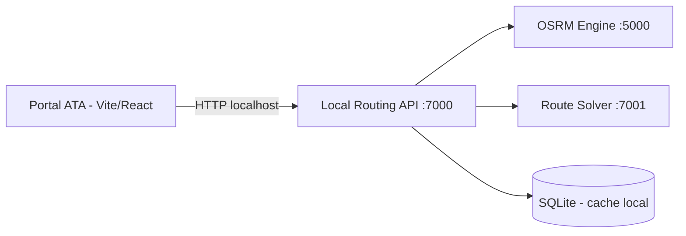
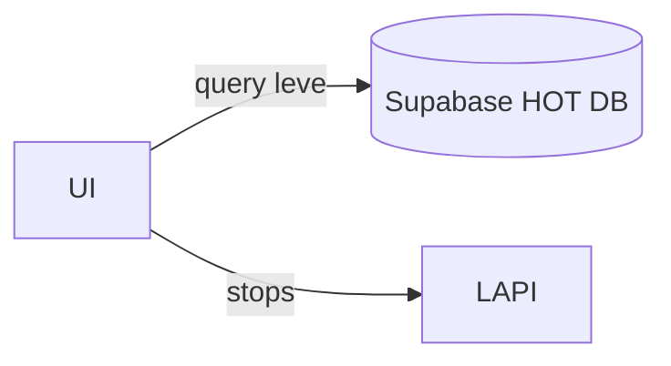

# 🧭 ATA Tools — Local Routing Engine (Companion)

⚠️ ATENÇÃO: o projeto dessa tool apenas será iniciado quando o restante do projeto (do site) estiver concluído.

> Status (2026-02-15): **planejado (blueprint)**. Este repositório ainda não contém `tools/router/` nem scripts `router:*`.

Este documento descreve o ATA Local Routing Engine, um projeto auxiliar (“companion”) responsável por gerar rotas otimizadas localmente, utilizando 100% do processamento da máquina do usuário.

O objetivo é substituir dependências externas (Google Maps, APIs pagas, limites de pontos) e evitar custos de infraestrutura, mantendo controle total, privacidade e performance previsível.

## 🎯 Objetivo principal

Permitir que administradores e assistentes:

- criem rotas com 50–150+ endereços;

- obtenham:

  - rota otimizada,

  - pins numerados,

  - ordem correta de visita;

- exportem:

  - GPX (uso no InRoute, GPS, apps offline),

  - XLSX/CSV (email, conferência);

- sem depender de serviços pagos, limites de uso ou APIs externas.

Todo o processamento acontece localmente, via localhost.

## 🧠 Filosofia do projeto

- ❌ Não é um microserviço cloud

- ❌ Não usa Vercel / Supabase / Turso

- ✅ Processamento pesado é local

- ✅ UI leve, cálculo pesado fora do navegador

- ✅ Sem limites artificiais de pontos

- ✅ Ferramenta interna, sem risco de fornecedor desligar ou pedir pagamento pelo serviço

> Se o PC desligar ou travar, o processo é interrompido — e isso é aceitável, pois é uma ferramenta operacional, não um backend crítico.

## 🏗️ Arquitetura geral



### Componentes

1. Portal ATA (UI)

- Apenas interface:

  - upload de planilhas,

  - visualização da rota,

  - download de arquivos.

- Nunca executa cálculo pesado, mas todo cálculo será realizado na máquina do usuário.

2. Local Routing API

- API HTTP local (localhost:7000)

- Orquestra:

  - geocode,

  - cache,

  - OSRM,

  - solver.

- Controla timeout, validações e status.

### 3. OSRM (Open Source Routing Machine)

- Calcula:

  - distância,

  - tempo,

  - matriz de custo.

- Usa mapas locais.

- Zero custo por requisição.

### 4. Solver (OR-Tools / heurístico)

- Resolve:

  - melhor ordem de visita,

  - TSP / VRP simples.

- Ajustável para heurísticas futuras.

### 5. Cache local (SQLite)

- Cache de geocode (endereço → lat/lng)

- Evita:

  - repetir cálculos,

  - dependência de APIs externas.

## 🗂️ Estrutura planejada no repositório

```
tools/
└── router/
    ├── docker-compose.yml
    ├── apps/
    │   └── api/          # Express/Fastify API local
    ├── services/
    │   ├── osrm/         # OSRM + mapas
    │   └── solver/       # OR-Tools / heurísticas
    ├── data/
    │   ├── maps/         # mapas regionais
    │   └── cache.db      # sqlite
    └── README.md         # README específico do router
```

## ▶️ Como rodar localmente (quando implementado)

**Pré-requisitos:**

- Docker + Docker Compose

- Node.js (para o portal)

**Ou diretamente:**

```
docker compose -f tools/router/docker-compose.yml up --build
```

**Verificar se está rodando**

```
GET http://localhost:7000/health
```

**Resposta esperada:**

```
{ "ok": true }
```

## 🔌 Integração com o portal ATA

**Comunicação**

- Sempre via HTTP localhost

Exemplo:
```
  POST http://localhost:7000/api/optimize
```

**Payload esperado (exemplo)**

```
{
  "stops": [
    {
      "external_id": "352885727",
      "address1": "96 FAMILY CIRCLE",
      "city": "JEFFERSONVILLE",
      "state": "GA",
      "zip": "31044"
    }
  ],
  "options": {
    "roundtrip": true,
    "optimize": true
  }
}
``` 

**Resposta**
``` 
{
  "orderedStops": [
    { "index": 1, "external_id": "352885727" }
  ],
  "distance_km": 42.3,
  "duration_minutes": 78,
  "gpx": "<xml>...</xml>"
}
```

## ⚠️ Limitações conhecidas (assumidas)

- 100+ pontos:

  - pode levar segundos ou minutos;

  - depende da máquina do usuário.

- OSRM /table cresce em O(n²).

- Não há persistência remota.

- Se o processo cair, o job é perdido.

Essas limitações são aceitáveis para o contexto operacional.

## 🧠 Boas práticas na UI

- Sempre checar /health antes de otimizar.

- Mostrar aviso:

  - “Router local não encontrado. Inicie o companion.”

- Timeout curto (5–10s) para chamadas HTTP.

- Não travar a UI esperando resposta.

- Futuro: jobs assíncronos com job_id.

## 🔮 Integração futura com o HOT DB (Supabase)

Quando houver estabilidade financeira:

**O que MUDA**

- A UI poderá buscar endereços direto do banco HOT:

  - `external_id`

  - `address1`

  - `city/state/zip`

- Somente leitura

- Sem cálculo no backend cloud

**O que NÃO MUDA**

- Cálculo continua local

- OSRM continua local

- Solver continua local

- Zero egress pesado do Supabase



## 🚫 O que este projeto NÃO é

❌ Não é serviço SaaS

❌ Não é backend distribuído

❌ Não precisa escalar horizontalmente

## 📌 Decisões importantes (registradas)

- Usar OSRM (open-source) em vez de Google Maps

- Resolver rotas localmente

- Aceitar processamento pesado no cliente

- Manter o portal como UI + orquestração

- Evitar qualquer dependência crítica externa

## 🧠 Regra de ouro

Se existir uma decisão entre custo cloud e uso da máquina do usuário, escolher sempre a máquina do usuário.

## 📎 Relação com outros documentos

- README.md → visão geral do portal ATA

- README-regras.md → regras arquiteturais

- README-objetivos.md → próximos objetivos

- README-HANDOFF.md → contexto para novos devs

- README-tools-routing.md (este) → criação de rotas

## 🚀 Próximos passos planejados

- [ ] Tela dedicada no portal (/dashboard/routes)

- [ ] Upload XLSX/CSV com preview

- [ ] Export GPX + XLSX

- [ ] Clusterização por cidade/ZIP (modo rápido)

- [ ] Cancelamento de job

- [ ] Indicador visual de progresso

- [ ] Match futuro GPX ↔ ordens (opcional)
